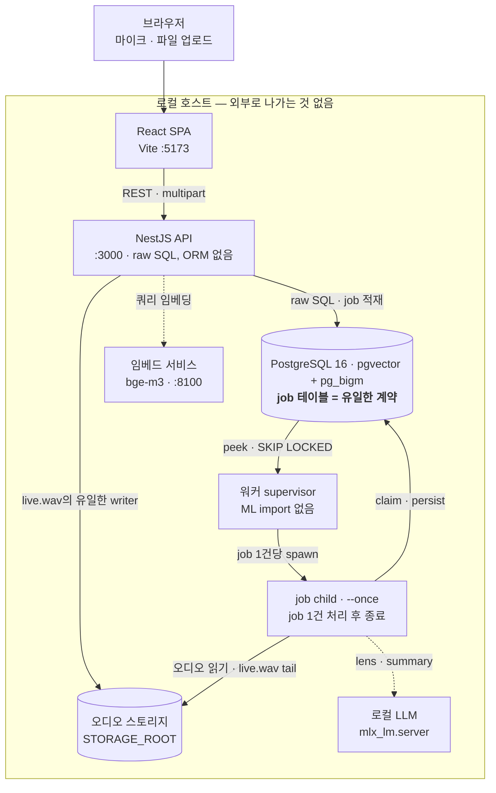

<div align="center">


# 담화 (Damwha)

**직접 돌리는 대화 기록·검색 서비스.** 모든 발언이 화자·시각과 함께 남고,
언제든 원본 오디오의 그 순간으로 되돌아갈 수 있다.
전부 내 맥에서 돈다 — 클라우드 ML 없고, 성문은 디스크 밖으로 나가지 않는다.

[](LICENSE)
[](.nvmrc)
[](package.json)
[](be/worker/pyproject.toml)
[](#ml-모델--게이트-걸림-용량-큼)

### [▶ 공개 데모 열기](https://damwha-demo.0kimjae.dev)

[English](README.md) · **한국어**

[기능](#기능) · [어떻게 돌아가나](#어떻게-돌아가나) · [빠른 시작](#빠른-시작) · [아키텍처 문서](be/CLAUDE.md)

</div>

---

## 무엇인가

대화는 계속 쌓이는데 "그때 그 얘기"를 다시 찾기는 어렵다. 기억은 흐려지고,
녹취록은 길고, 원하는 대목이 어디 있는지 모른다. 기존 STT 서비스는 매번
"참석자 1"을 손으로 고쳐야 했다.

담화의 1급 객체는 **발언(utterance)**이다. 발언 하나가 네 가지에 묶인다 —
**누가** 말했는가(성문 기반 자동 식별), **언제**(어느 대화, 몇 분 몇 초),
**원문과 원본 오디오**, 그리고 **앞뒤 맥락**. 여기서 시그니처 기능이 나온다:
*발언 점프* — 검색 결과에서든 추출된 결정에서든, 정확히 그 순간으로 뛰어
직접 들어 본다.

녹음 대상은 회의일 수도, 인터뷰나 통화일 수도, 그냥 대화일 수도 있다 —
파이프라인 어디에도 "회의"라는 전제가 없다. 할 일·결정·약속 추출은 그 위에
얹힌 확장층이라, 대화가 회의형이 아니면 0건이 나오고 섹션이 알아서 사라진다.

**비목표** — 팀 협업 위키, 구성원별 발언량 분석 대시보드, 회의 지식 그래프.
개인 대화 기억이지 팀 모니터링 도구가 아니다.

> **녹음하기 전에** — 담화는 녹음 고지를 화면에 띄우지 않고, 대화에 참여한
> 모든 사람의 성문(voiceprint)을 로컬 DB에 저장한다. 동의를 확보할 책임은
> 이걸 돌리는 사람에게 있다. → [녹음과 동의](#녹음과-동의)

## 공개 데모

**[damwha-demo.0kimjae.dev](https://damwha-demo.0kimjae.dev)** — 읽기 전용,
가입 없음. 1분 둘러보기가 업로드 → 화자 분리 → 전사 → 검색까지 훑는다.

샘플 대화 3건은 Google NotebookLM의 Audio Overview다(**AI가 생성한 음성이며
실제 인물이 아니다** — 첫 방문 모달이 이를 고지한다). 결과는 이 오디오를 M2에서
**실제 파이프라인**으로 처리한 그대로다. 목업이 아니다.

## 기능

| | |
| --- | --- |
|  |  |
| **화자가 붙은 전사.** 좌(대화 목록)·중앙(전사)·우(인사이트) 3-pane. 아래 레일은 녹음 전체에 걸친 화자별 발화 타임라인이라, 아무 데나 클릭하거나 드래그하면 그 지점으로 이동한다. | **⌘K 검색은 어느 화면에나.** bge-m3 벡터 + BM25/pg_bigm 하이브리드로 발언과 대화를 함께 찾는다. 결과를 누르면 곧장 그 순간으로 뛴다. |
|  |  |
| **모든 대화를 가로지르는 렌즈.** 로컬 LLM이 뽑은 할 일·결정·약속을 근거 발언 링크와 함께 모아 본다. 자동으로 채우되 막지 않고, 나중에 고칠 수 있으며, 재추출해도 사람이 손댄 항목은 보존된다. | **머신에 맞춘 프리셋.** 호스트 맥의 실제 사양을 읽어 프리셋을 추천한다. 프리셋마다 Whisper 크기·요약 모델·단계별 CPU/GPU 배치가 고정돼 있다. |

이 밖에 — 브라우저 실시간 녹음(미리보기 포함), 대화별 메모, 화자 등록과
대화 간 동일인 연결, 내보내기, 예전 녹음을 새 모델로 재처리.

## 어떻게 돌아가나



파이프라인 자체는 이렇다.

```
오디오 → ffmpeg 정규화 → VAD → 화자 분리 → 화자 식별(pgvector 코사인)
      → STT(Whisper) → 구조화 JSON → 검색 인덱싱 → 렌즈 ∥ 요약 → 저장
```

**API와 워커는 HTTP로 대화하지 않는다.** 둘 사이의 계약은 Postgres `job` 테이블
하나뿐이고, 같은 payload를 TypeScript 쪽 zod와 Python 쪽 pydantic이 각각 검증한다.
공유하는 다른 행은 `app_setting.worker_capabilities` 하나 — 워커가 쓰고 API는
읽기만 한다. 그래서 API가 자기 컨테이너 대신 호스트 맥의 사양을 보고할 수 있다.

`pnpm worker`가 띄우는 **supervisor** 부모는 ML 라이브러리를 import하지 않는다.
job 1건마다 `--once` child를 새로 띄우고 그 child는 job이 끝나면 종료하므로,
MLX/torch가 잡은 GPU 메모리를 OS가 매번 회수한다 — 쌓여서 OOM으로 가지 않는다.

대화형 다이어그램(검색·포커스·경로 추적이 되는 단일 파일 HTML)은
[`docs/diagrams/`](docs/diagrams/README.md)에 있다.

## 저장소 구성

| 경로 | 패키지 | 스택 |
| --- | --- | --- |
| `be/` | `damwha-be` | NestJS 10 HTTP API — Postgres(pgvector + pg_bigm) 위 raw SQL, ORM 없음 |
| `be/worker/` | *(uv 프로젝트)* | Python 3.12 ML 워커: ffmpeg → VAD → 화자 분리 → 화자 식별 → STT → align, 그리고 로컬 LLM으로 렌즈/요약 추출 |
| `fe/` | `damwha-fe` | React 19 + Vite 8 + Tailwind 4 SPA |
| `packages/contracts/` | `@damwha/contracts` | 두 Node 패키지가 합의해야 하는 wire enum |

`be/worker`는 uv가 관리하며 pnpm 워크스페이스 멤버가 **아니다**.

## 녹음과 동의

담화는 **녹음 고지를 화면에 띄우지 않는다.** 사용자는 적용되는 법에 따라 필요한
고지와 동의를 확보해야 한다. 개인용·로컬 전용이라는 설계만으로 법적 의무가
면제되지는 않는다.

저장되는 것이 녹취록만이 아니라는 점도 분명히 해 둔다 — 화자 식별을 위해 대화에
참여한 **모든 사람의 성문**이 로컬 DB에 남는다. 본인 것만이 아니다. 그리고
내보내기 버튼은 확인 절차 없이 파일을 생성한다.

녹음과 개인정보 처리의 적법성은 적용 관할, 대화의 성격, 처리 목적에 따라 갈린다.
관할마다 요건이 다르고 개정·판례로 계속 바뀌기 때문에 이 문서는 특정 조문이나
판례를 안내하지 않는다. 로컬에만 저장해도 녹음·처리 단계에서 의무가 생길 수 있고,
개인 용도인지 업무인지가 갈림길이지 데이터가 어디 있는지가 갈림길이 아니다.

**이 도구로 하는 녹음과 그 처리에 대한 법적 책임은 전적으로 쓰는 사람에게 있다.**
법률 자문이 아니다. 자기 관할의 현행 규칙은 직접 확인할 것. 애매하면 녹음 전에
동의를 받는 쪽이 언제나 안전하다.

## 준비물

| 도구 | 왜 | 설치 |
| --- | --- | --- |
| Node 22 (`.nvmrc`) | API + SPA | `nvm install` |
| pnpm 10.26.0 | 루트 `package.json`에 고정 | `corepack enable` |
| Docker | Postgres 이미지(pgvector + pg_bigm), 그리고 jest/pytest 스위트(testcontainers) | Docker Desktop |
| [uv](https://docs.astral.sh/uv/) | Python 워커의 환경 + 락파일 | `curl -LsSf https://astral.sh/uv/install.sh \| sh` |
| **ffmpeg** (`PATH`에) | 모든 오디오 job이 업로드 정규화로 시작한다(`pipeline/ffmpeg.py`). 바이너리가 없으면 기동이 아니라 job이 실패한다 | `brew install ffmpeg` |
| **mlx-lm** (`PATH`에) | 렌즈/요약 LLM을 서빙한다. 워커 venv **바깥에** 설치할 것 — 워커는 `mlx_lm`을 import하지 않고 `mlx_lm.server` 바이너리를 spawn한다 | `uv tool install mlx-lm` |
| Hugging Face 계정 + 토큰 | pyannote 화자 분리는 **게이트 걸린** 모델이다 | [ML 모델](#ml-모델--게이트-걸림-용량-큼) 참고 |

Apple Silicon이 상정한 타깃이다. STT는 `mlx-whisper`, LLM은 MLX로 돈다.
그 밖의 환경에서는 STT가 `faster-whisper`(CPU)로 떨어지고, `gpu`를 요구하는 job은
`gpu_unavailable`로 **영구 실패**한다 — CPU 폴백은 일부러 두지 않았다(재현성).
Apple이 아닌 하드웨어라면 `light` 프리셋을 쓰거나 `custom`으로
`devices.{diarization,stt} = cpu`를 잡고, 렌즈/요약은 다른 OpenAI 호환 서버가
필요하다고 보면 된다([렌즈 / 요약 LLM](#렌즈--요약-llm) 참고).

## 빠른 시작

```bash
corepack enable            # 고정된 pnpm@10.26.0 활성화
pnpm install               # 루트 락파일 하나로 be + fe 설치

cp be/.env.example be/.env                # DATABASE_URL, STORAGE_ROOT, 모델 관련 env
cp be/worker/.env.example be/worker/.env  # DATABASE_URL, HF_TOKEN, LENS_LLM_BASE_URL
cp fe/.env.example fe/.env                # VITE_API_BASE_URL

pnpm db:up                 # Postgres(pgvector + pg_bigm). 첫 실행은 이미지를 빌드한다
pnpm be:migrate            # SQL 마이그레이션 적용
pnpm dev                   # API :3000 (라우트는 /api, Swagger는 /docs) + Vite :5173 병렬
```

여기까지가 API와 UI다. 녹음을 올리려면 아래 Python 워커가 추가로 필요하다 —
없으면 회의가 `queued`에 그대로 앉아 있는다.

## 환경 파일

**`.env`는 패키지마다 따로 둔다. 루트 `.env`는 없고, 있어서도 안 된다.**
각 프로세스는 자기 옆의 파일을 읽고 상대 경로를 자기 cwd 기준으로 푼다.
그래서 같은 키가 두 파일에서 다른 값을 갖는다.

| 파일 | 읽는 쪽 | 복사 원본 |
| --- | --- | --- |
| `be/.env` | NestJS API (`src/main.ts`의 `import 'dotenv/config'`) | `be/.env.example` |
| `be/worker/.env` | Python 워커 + 임베드 서비스 (pydantic-settings) | `be/worker/.env.example` |
| `fe/.env` | Vite (`VITE_` 접두어가 붙은 키만 브라우저까지 간다) | `fe/.env.example` |

example 파일은 전부 채워져 있고 주석도 달려 있다 — 복사해서 고칠 것, 직접 쓰지 말 것.
실제로 신경 써야 하는 건 이만큼이다.

- **`STORAGE_ROOT`는 일부러 다르다.** `be/.env`는 `./storage`, `be/worker/.env`는
  `../storage`이고 둘이 *같은* 디렉터리로 풀려야 한다. 저장소 루트에서 패키지를
  실행하면 안 되는 이유도 이것 — 루트 스크립트(`pnpm be …`, `pnpm worker`)가
  `--filter` / `uv run --directory`로 cwd를 대신 잡아 준다.
- **`HF_TOKEN`** (워커) — pyannote에 필수. 토큰이 비면 화자 분리가 실패한다.
- **`LENS_LLM_BASE_URL`** (워커) — **필수이고 기본값이 없다.** 포트도 명시해야 한다
  (워커가 그 host:port로 LLM 서버를 띄운다). 기본값을 두면 "주소를 설정 안 했다"와
  "그 주소에 아무도 안 떠 있다"가 구분되지 않는다.
- **`SUMMARY_LLM_MODEL` / `LENS_LLM_MODEL`**은 `be/.env`와 `be/worker/.env`에서
  **똑같아야 한다.** API가 자기 값을 job payload에 찍어 보내므로, 어긋나면 워커가
  설정과 다른 모델을 돌린다. `SUMMARY_LLM_MODEL`은
  `packages/contracts/src/index.ts`의 카탈로그(`mlx-community/Qwen3.5-{4B,9B,27B}-8bit`)
  위에 얹힌 zod enum이라, 바깥 값을 넣으면 API가 부팅을 못 한다.
- **`IDENTIFY_THRESHOLD` / `IDENTIFY_SUGGEST_THRESHOLD`**의 기본값은
  `be/worker/scripts/eval_speaker_id.py`로 *측정한* 값이다. 바꿀 거면 그 도구로
  다시 재라. 눈대중으로 고치지 말 것.
- **API는 `.env`를 부팅 때 한 번만 읽는다.** `nest start --watch`는 소스만 보므로
  `be/.env`를 고쳤으면 실제로 재시작해야 한다(`touch`로는 안 된다).

## Python ML 워커

```bash
pnpm worker:sync       # 실제 ML 모델(mlx-whisper/pyannote/ECAPA/bge-m3) — `pnpm worker`가 필요로 하는 것
pnpm worker:sync:test  # 결정적 의존성만(테스트용, 모델 없음)
pnpm worker:test       # pytest — Docker 필요(testcontainers)
pnpm worker            # supervisor 실행
```

`uv sync`는 *정확한* 환경을 만들기 때문에 두 sync 스크립트는 서로를 덮어쓴다 —
`worker:sync:test`는 torch를 비롯한 것들을 지운다. 그 venv로 진짜 워커를 돌리면
모든 job이 `model_load_failed` / `PERMANENT`(`No module named 'torch'`)로 실패한다.
모델은 optional extra(`[project.optional-dependencies] models`)이고 ML import는
lazy라, job이 실제로 하나를 claim할 때까지 아무도 불평하지 않는다. 테스트용 sync를
돌렸으면 `pnpm worker:sync`를 다시 돌릴 것.

### ML 모델 — 게이트 걸림, 용량 큼

`models` extra는 torch, pyannote, speechbrain, mlx-whisper, bge-m3를 끌어온다.
가중치까지 내려오면 수십 GB다. pyannote는 **게이트가 걸려 있으므로**, 첫 실행 전에
Hugging Face에 로그인해 라이선스 세 개를 모두 수락해야 한다.

1. 수락: [speaker-diarization-3.1](https://huggingface.co/pyannote/speaker-diarization-3.1),
   [segmentation-3.0](https://huggingface.co/pyannote/segmentation-3.0),
   [speaker-diarization-community-1](https://huggingface.co/pyannote/speaker-diarization-community-1)
2. 토큰을 `be/worker/.env`에 `HF_TOKEN=hf_...`로 넣는다
3. 선택 — 미리 받아 두기(안 하면 첫 job이 내려받는다):
   ```bash
   uv run --directory be/worker python scripts/download_models.py
   ```

### 임베드 서비스

**워커와는 별개 프로세스다** — 워커가 띄우지도, 호출하지도 않는다. bge-m3를 loopback
HTTP로 서빙하며 호출자는 **API** 하나뿐이고, 용도는 검색 *쿼리* 임베딩이다.
API가 TypeScript라 모델을 in-process로 못 돌리기 때문. 발언 임베딩은 워커가
`index_meeting`에서 자기 in-process 임베더로 처리한다. pnpm 스크립트는 없고,
워커 패키지에서 직접 띄운다.

```bash
uv run --directory be/worker uvicorn damwha_worker.embed_service:app --host 127.0.0.1 --port 8100
curl -s http://127.0.0.1:8100/health        # 첫 기동은 모델을 데운다: 30–90초
```

죽어 있어도 아무것도 터지지 않는다. 녹음과 인덱싱은 영향이 없고, API는 키워드
검색(BM25 / pg_bigm)만으로 조용히 폴백한다 — **검색창이 결과를 내놓는다고 해서
서비스가 떠 있다는 증거는 아니다.** `SEARCH_EMBEDDING_MODEL`과
`SEARCH_EMBEDDING_DIM`은 `be/.env`와 `be/worker/.env`에서 동일해야 한다.
모델명이 다르면 API가 응답을 거부하고 같은 방식으로 성능이 떨어진다 — 다른 모델의
1024차원은 다른 벡터 공간이니까.

### 렌즈 / 요약 LLM

렌즈 추출과 대화 요약은 **OpenAI 호환** 엔드포인트 하나(`LENS_LLM_BASE_URL`)를
공유하고 모델 이름만 다르다. Ollama 의존성은 없다. 로컬 런타임은 `mlx_lm.server`인데,
요청의 `model` 필드를 HF repo id로 그대로 해석하고 별칭을 둘 방법이 없다 —
카탈로그가 repo id를 저장하는 이유다.

기본값 `LENS_LLM_MANAGED=true`에서는 **아무것도 띄울 필요가 없다.** 렌즈/요약 child가
job 직전에 payload의 모델로 `mlx_lm.server`를 띄우고 끝나면 SIGTERM으로 내린다.
27B 8-bit(약 28 GB)가 큐가 비어 있는 동안 메모리를 붙들고 있지 않게 하려는 것이고,
대가는 job마다 모델 로드 1회다. 직접 띄운 서버가 있으면 그걸 감지해 재사용하고
절대 죽이지 않는다.

```bash
mlx_lm.server --model mlx-community/Qwen3.5-4B-8bit \
  --chat-template-args '{"enable_thinking":false}' \
  --host 127.0.0.1 --port 8000
```

바이너리가 `PATH`에 없으면 렌즈/요약 job이 `llm_server_start_failed`(PERMANENT)로
실패한다. `process_meeting`은 영향이 없다 — LLM을 아예 건드리지 않는다.

## 전체 스택 띄우기

순서를 강제하는 건 Postgres뿐이다. 나머지는 서로가 아니라 DB하고만 말하므로
아무 순서로나(그리고 나중에, 재시작 없이) 띄워도 된다.

1. `pnpm db:up` → `pnpm be:migrate` — **먼저 해야 한다**
2. `pnpm be:dev` (API :3000, Swagger는 `/docs`) — 또는 API + SPA를 함께 띄우려면 `pnpm dev`
3. `pnpm worker`
4. 임베드 서비스 — API의 검색 쿼리만 쓴다. 아무 때나 띄우되, 검색 품질을 판단하기
   전에 `/health`가 `{"status":"ok"}`인지 확인할 것
5. *(선택)* 렌즈/요약 LLM. 워커에 맡기지 않고 직접 띄우고 싶다면

그다음 UI에서 녹음을 올리면(또는 `POST /meetings`), 회의가 `queued → done`으로 가며
화자가 붙은 타임라인이 나온다. 엔드투엔드 스모크 스크립트, 프리셋별 점검, 품질 측정
도구는 [`be/worker/SMOKE.md`](be/worker/SMOKE.md)에 있다.

## 팀에 빌드 넘기기

`deploy/`는 API + SPA를 Docker 이미지 하나로, 워커를 wheel로 묶어서 받는 쪽이 소스를
체크아웃하지 않아도 되게 한다. `deploy/release.sh <버전>`이 arm64 이미지 두 개를
GHCR로 올리고, wheel과 실행 폴더 tarball을 GitHub Release에 붙인다. 받는 사람용
안내는 [`deploy/README.md`](deploy/README.md). 워커는 여전히 호스트에서 돈다 —
MLX에는 Apple Silicon이 필요하고 Docker의 리눅스 VM은 그걸 못 준다.

공개 데모는 **별개 릴리스**다. 이미지도 시드 데이터도 따로다 —
내보내는 쪽은 [`deploy/demo/README.md`](deploy/demo/README.md),
그 안에 무엇이 들었는지는 [`demo/README.md`](demo/README.md).

## 자주 쓰는 명령

```bash
pnpm build          # be + fe
pnpm test           # be(jest, Docker 필요) + fe(vitest)
pnpm lint           # fe만 — damwha-be에는 lint 스크립트가 없다
pnpm be <script>    # damwha-be의 아무 스크립트, 예: `pnpm be test:e2e`
pnpm fe <script>    # damwha-fe의 아무 스크립트, 예: `pnpm fe format`
pnpm db:logs        # Postgres 로그 따라가기
```

패키지 명령은 저장소 루트에서 이 스크립트들을 통해 돌리거나, `cd`로 패키지에
들어가서 돌린다. `be/` 안에서 `npm install`은 **하지 말 것** — 워크스페이스가 더는
쓰지 않는 hoisted `node_modules`와 `package-lock.json`을 다시 만든다.

## 이 저장소에서 작업하려면

API나 워커를 건드리기 전에 [`be/CLAUDE.md`](be/CLAUDE.md)를 읽는다(job 계약, 소유권
가드, 측정된 화자 식별 임계값). UI를 건드리기 전에는 [`fe/CLAUDE.md`](fe/CLAUDE.md)와
[`fe/DESIGN.md`](fe/DESIGN.md). 이것들이 살아 있는 문서이고, 루트의
[`CLAUDE.md`](CLAUDE.md)는 모노레포 지도만 담는다.

## 라이선스

[MIT](LICENSE) © 2026 김영재.

라이선스가 덮는 것은 이 저장소의 소스뿐이다. 워커가 돌리는 ML 모델은 설치 시점에
**각자의 약관**으로 내려받는 것이고 여기에 벤더링되지도 재배포되지도 않는다 —
pyannote 화자 분리는 게이트 걸린 Hugging Face 모델이라 사용자가 각자 수락해야 하고
([`deploy/HUGGINGFACE.md`](deploy/HUGGINGFACE.md) 참고), `ffmpeg`는 직접 설치한
외부 바이너리를 호출해 쓴다.
