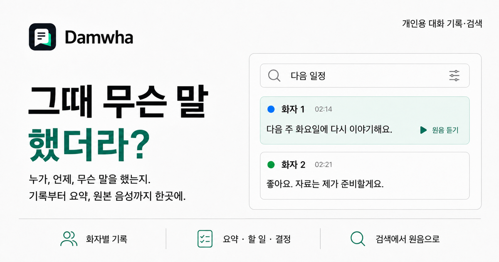
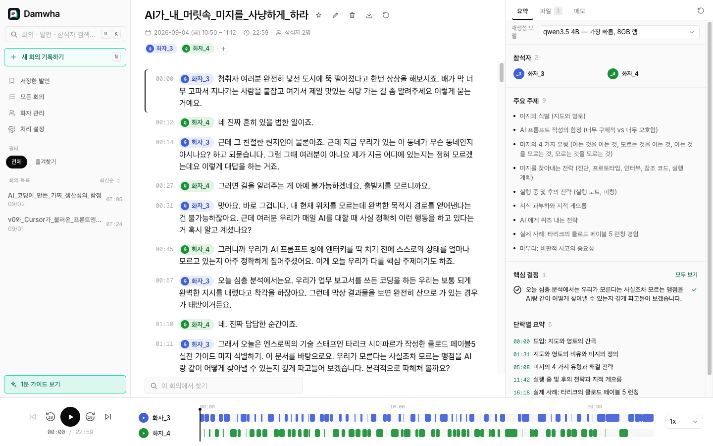
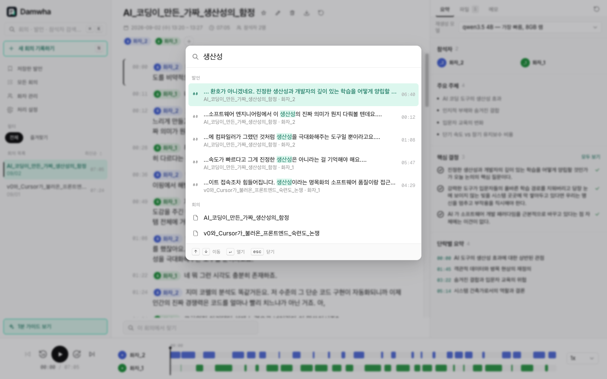
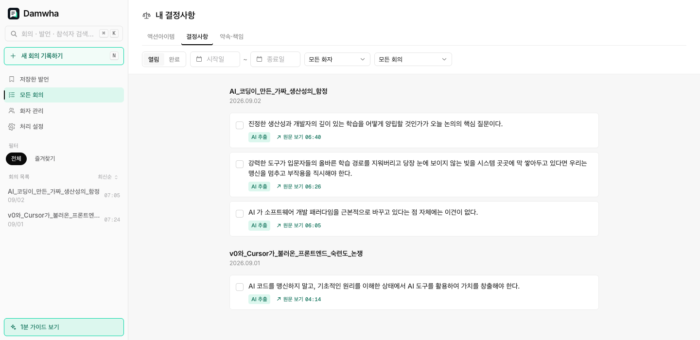
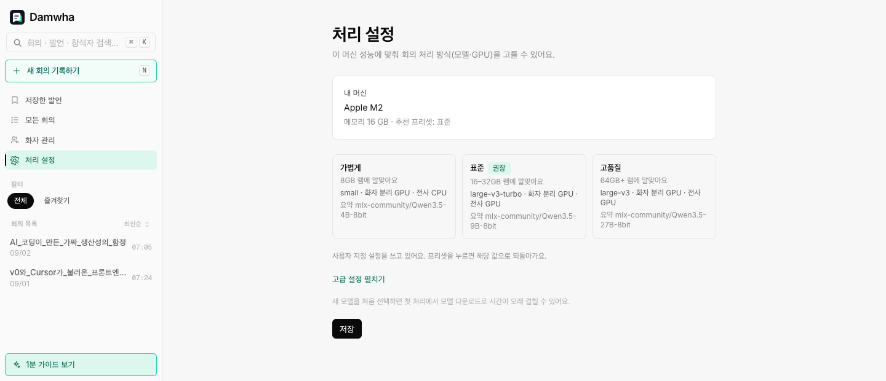
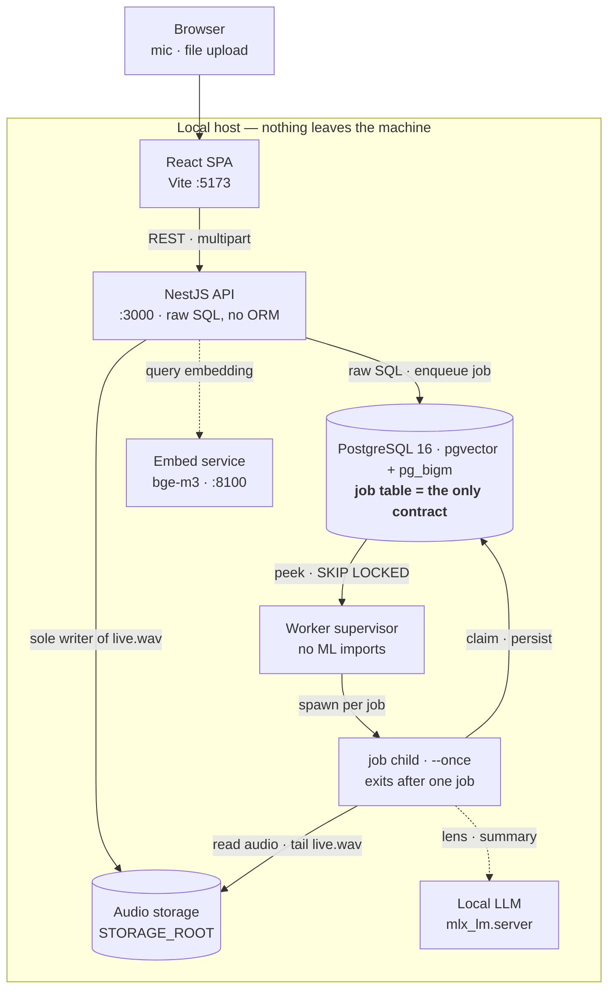

<div align="center">



# Damwha (담화)

**Self-hosted conversation recording and search.** Every utterance is
speaker-attributed, timestamped, and traceable back to the original audio.
Everything runs on your own Mac — no cloud ML, voiceprints stay on disk.

[](LICENSE)
[](.nvmrc)
[](package.json)
[](be/worker/pyproject.toml)
[](#ml-models-gated-heavy)

### [▶ Try the live demo](https://damwha-demo.0kimjae.dev)

**English** · [한국어](README.ko.md)

[Features](#features) · [How it works](#how-it-works) · [Quickstart](#quickstart) · [Architecture docs](be/CLAUDE.md)

</div>

---

## What it is

Conversations pile up, but finding "that thing we said" doesn't get easier.
Memory fades, transcripts are long, and every STT service makes you rename
"Speaker 1" by hand every single time.

Damwha treats the **utterance** as the primary object. Each one is tied to four
things — **who** said it (voiceprint-based automatic identification), **when**
(which conversation, at what second), the **original text and audio**, and the
**surrounding turns**. That's what makes the signature capability work:
*utterance jump* — from a search hit or an extracted decision, land on the exact
moment and hear it.

A recording may be a meeting, an interview, a call, or just a conversation —
nothing in the pipeline assumes "meeting". Typed extraction (action items,
decisions, promises) is an extension layer: when a conversation isn't
meeting-shaped it simply yields nothing and the section disappears.

**Non-goals:** team wikis, per-member analytics dashboards, meeting knowledge
graphs. This is a personal conversation memory, not a team monitoring tool.

> The product UI and the design docs are written in **Korean**. Code, API, and
> this README are in English.

> **Before you record** — Damwha shows no recording notice, and it stores a
> voiceprint for every participant in the conversation, not just yours. Getting
> consent is on whoever runs it. → [Recording and consent](#recording-and-consent)

## Live demo

**[damwha-demo.0kimjae.dev](https://damwha-demo.0kimjae.dev)** — read-only, no
signup. A 1-minute guided tour walks upload → diarization → transcript → search.

The three sample conversations are Google NotebookLM Audio Overviews (**AI-generated
voices, not real people** — the first-visit notice says so), processed by the
*actual* pipeline on an M2. What you see is real output, not a mockup.

## Features

| | |
| --- | --- |
|  |  |
| **Speaker-attributed transcript.** Three-pane shell: conversation list, transcript, insight panel. The bottom rail is a per-speaker activity timeline over the whole recording — click or drag anywhere on it to seek. | **⌘K search, everywhere.** Hybrid search (bge-m3 vectors + BM25/pg_bigm) over utterances *and* conversations, from any screen. Hits jump straight to the moment. |
|  |  |
| **Lenses across every conversation.** Action items, decisions, and promises extracted by a local LLM, each with a jump-to-evidence link. Auto-filled, non-blocking, and post-editable — re-extraction preserves anything you touched. | **Hardware-aware presets.** The app reads the host Mac's actual spec and recommends a preset; each one pins a Whisper size, a summary model, and per-stage CPU/GPU placement. |

Also: browser-based live recording with a running preview, per-conversation
notes, speaker enrollment and cross-conversation identity, export, and
re-processing an old recording with a newer model.

## How it works



The pipeline itself:

```
audio → ffmpeg normalize → VAD → diarization → speaker ID (pgvector cosine)
      → STT (Whisper) → structured JSON → search indexing → lens ∥ summary → store
```

**The API and the worker never talk over HTTP.** The Postgres `job` table is the
only contract between them, validated by zod on the TypeScript side and pydantic
on the Python side. The one other shared row is `app_setting.worker_capabilities`,
written by the worker and read-only for the API — that's how the API reports the
host Mac's spec instead of its own container's.

`pnpm worker` starts a **supervisor** parent that imports no ML libraries; per job
it spawns a `--once` child that exits when the job is done, so the OS reclaims
MLX/torch GPU memory between jobs instead of accumulating it into an OOM.

Interactive versions of these diagrams (searchable, path-traceable, single-file
HTML) live in [`docs/diagrams/`](docs/diagrams/README.md).

## Repository layout

| Path | Package | Stack |
| --- | --- | --- |
| `be/` | `damwha-be` | NestJS 10 HTTP API — raw SQL over Postgres (pgvector + pg_bigm), no ORM |
| `be/worker/` | *(uv project)* | Python 3.12 ML worker: ffmpeg → VAD → diarization → speaker ID → STT → align, plus lens/summary extraction via a local LLM |
| `fe/` | `damwha-fe` | React 19 + Vite 8 + Tailwind 4 SPA |
| `packages/contracts/` | `@damwha/contracts` | Wire enums both Node packages must agree on |

`be/worker` is managed by uv and is **not** a pnpm workspace member.

## Recording and consent

Damwha **shows no recording notice**. Users must provide any notice and obtain
any consent required by applicable law. A personal, local-only design does not
itself exempt its use from legal obligations.

Note also what gets stored: to identify speakers, a **voiceprint for every
participant** lands in your local database, not just your own. And the export
button writes the file without a confirmation step.

Whether a recording and the processing that follows are lawful depends on the
jurisdiction, the nature of the conversation, and the purpose of processing.
Requirements differ from place to place and keep changing through amendments and
case law, so this document points to no specific statute or decision. Obligations
can arise while recording and processing even when everything stays local — what
decides it is whether the activity is personal or professional, not where the
data sits.

**Legal responsibility for any recording made with this tool, and for what is
done with it, rests entirely with the person using it.** This is not legal
advice. Check the current rules in your own jurisdiction. When in doubt, ask
before you record.

## Prerequisites

| Tool | Why | Install |
| --- | --- | --- |
| Node 22 (`.nvmrc`) | API + SPA | `nvm install` |
| pnpm 10.26.0 | pinned in the root `package.json` | `corepack enable` |
| Docker | Postgres image (pgvector + pg_bigm), and the jest/pytest suites (testcontainers) | Docker Desktop |
| [uv](https://docs.astral.sh/uv/) | the Python worker's env + lockfile | `curl -LsSf https://astral.sh/uv/install.sh \| sh` |
| **ffmpeg** on `PATH` | every audio job starts by normalizing the upload (`pipeline/ffmpeg.py`); a missing binary fails the job, not startup | `brew install ffmpeg` |
| **mlx-lm** on `PATH` | serves the lens/summary LLM. Install it **outside** the worker venv — the worker never imports `mlx_lm`, it spawns the `mlx_lm.server` binary | `uv tool install mlx-lm` |
| Hugging Face account + token | pyannote diarization is a **gated** model | see [ML models](#ml-models-gated-heavy) |

Apple Silicon is the intended target: STT runs `mlx-whisper` and the LLM runs MLX.
Elsewhere STT falls back to `faster-whisper` (CPU), and a job that asks for `gpu`
fails **permanently** with `gpu_unavailable` — there is no CPU fallback, on purpose
(reproducibility). On non-Apple hardware use the `light` preset or a `custom` config
with `devices.{diarization,stt} = cpu`, and expect the lens/summary jobs to need a
different OpenAI-compatible server (see [Lens / summary LLM](#lens--summary-llm)).

## Quickstart

```bash
corepack enable            # activates the pinned pnpm@10.26.0
pnpm install               # installs be + fe from the single root lockfile

cp be/.env.example be/.env                # DATABASE_URL, STORAGE_ROOT, model envs
cp be/worker/.env.example be/worker/.env  # DATABASE_URL, HF_TOKEN, LENS_LLM_BASE_URL
cp fe/.env.example fe/.env                # VITE_API_BASE_URL

pnpm db:up                 # Postgres (pgvector + pg_bigm); first run builds the image
pnpm be:migrate            # apply SQL migrations
pnpm dev                   # API :3000 (routes under /api, Swagger /docs) + Vite :5173, in parallel
```

That gets you the API and the UI. Uploading a recording additionally needs the
Python worker below — without it, meetings just sit in `queued`.

## Environment files

**`.env` files are per-package. There is no root `.env` and there must not be one.**
Each process loads the file next to it and resolves relative paths against its own
cwd, which is why the same key holds different values in two of them:

| File | Loaded by | Copy from |
| --- | --- | --- |
| `be/.env` | NestJS API (`import 'dotenv/config'` in `src/main.ts`) | `be/.env.example` |
| `be/worker/.env` | Python worker + embed service (pydantic-settings) | `be/worker/.env.example` |
| `fe/.env` | Vite (only `VITE_`-prefixed keys reach the browser) | `fe/.env.example` |

The examples are complete and commented — copy them and edit, don't hand-write.
What actually needs your attention:

- **`STORAGE_ROOT` differs by design.** `./storage` in `be/.env`, `../storage` in
  `be/worker/.env` — both must resolve to the *same* directory. This is also why you
  must never launch a package from the repo root: the root scripts (`pnpm be …`,
  `pnpm worker`) set the cwd via `--filter` / `uv run --directory` for you.
- **`HF_TOKEN`** (worker) — required for pyannote. Empty token = diarization fails.
- **`LENS_LLM_BASE_URL`** (worker) — **required, no default**, and the port must be
  explicit (the worker starts the LLM server on that host:port). A default would make
  "address not configured" indistinguishable from "nothing listening there".
- **`SUMMARY_LLM_MODEL` / `LENS_LLM_MODEL`** must be **identical in `be/.env` and
  `be/worker/.env`** — the API stamps its value into the job payload, so a mismatch means
  the worker runs a different model than you configured. `SUMMARY_LLM_MODEL` is a zod
  enum over the catalog in `packages/contracts/src/index.ts`
  (`mlx-community/Qwen3.5-{4B,9B,27B}-8bit`): a value outside it stops the API booting.
- **`IDENTIFY_THRESHOLD` / `IDENTIFY_SUGGEST_THRESHOLD`** are *measured* defaults from
  `be/worker/scripts/eval_speaker_id.py`. Re-measure with that tool; don't eyeball them.
- **The API reads `.env` once, at boot.** `nest start --watch` only watches sources, so
  after editing `be/.env` you must actually restart it (`touch` won't do it).

## Python ML worker

```bash
pnpm worker:sync       # real ML models (mlx-whisper/pyannote/ECAPA/bge-m3) — what `pnpm worker` needs
pnpm worker:sync:test  # deterministic deps only (tests, no models)
pnpm worker:test       # pytest — needs Docker (testcontainers)
pnpm worker            # run the supervisor
```

`uv sync` builds an *exact* environment, so the two sync scripts overwrite each other:
`worker:sync:test` uninstalls torch and friends. Running the real worker against that venv
fails every job with `model_load_failed` / `PERMANENT` (`No module named 'torch'`) — the
models are an optional extra (`[project.optional-dependencies] models`) and the ML imports
are lazy, so nothing complains until a job actually claims one. Re-run `pnpm worker:sync`
after any test-only sync.

### ML models (gated, heavy)

The `models` extra pulls torch, pyannote, speechbrain, mlx-whisper and bge-m3 — tens of
GB once the weights land. pyannote is **gated**: log into Hugging Face and accept all
three licenses before the first run.

1. Accept: [speaker-diarization-3.1](https://huggingface.co/pyannote/speaker-diarization-3.1),
   [segmentation-3.0](https://huggingface.co/pyannote/segmentation-3.0),
   [speaker-diarization-community-1](https://huggingface.co/pyannote/speaker-diarization-community-1)
2. Put the token in `be/worker/.env` as `HF_TOKEN=hf_...`
3. Optional pre-cache (otherwise the first job downloads them):
   ```bash
   uv run --directory be/worker python scripts/download_models.py
   ```

### Embed service

A **separate process from the worker** — the worker neither starts it nor calls it.
It serves bge-m3 over loopback HTTP for one caller: the **API**, embedding the search
*query*, because the API is TypeScript and can't run the model in-process. The worker
embeds utterances during `index_meeting` with its own in-process embedder. It has no
pnpm script — start it from the worker package:

```bash
uv run --directory be/worker uvicorn damwha_worker.embed_service:app --host 127.0.0.1 --port 8100
curl -s http://127.0.0.1:8100/health        # first start warms the model: 30–90 s
```

Nothing crashes when it's down: recording and indexing are unaffected, and the API
falls back to keyword-only search (BM25 / pg_bigm) — quietly, so a search box that
still returns results is not proof the service is up. Keep `SEARCH_EMBEDDING_MODEL`
and `SEARCH_EMBEDDING_DIM` identical in `be/.env` and `be/worker/.env`: the API
rejects a response whose model name doesn't match and degrades the same way, since
1024 dimensions from a different model is a different vector space.

### Lens / summary LLM

Lens extraction and conversation summary share one **OpenAI-compatible** endpoint
(`LENS_LLM_BASE_URL`) and differ only by model name. There is no Ollama dependency; the
local runtime is `mlx_lm.server`, which resolves the request's `model` field as an HF
repo id with no way to alias it — that's why the catalog stores repo ids.

With the default `LENS_LLM_MANAGED=true` **you don't start anything**: the lens/summary
child launches `mlx_lm.server` with the payload's model just before the job and SIGTERMs
it after, so a 27B 8-bit model (~28 GB) isn't holding memory while the queue is idle.
The cost is one model load per job. A server you started yourself is detected, reused,
and never killed:

```bash
mlx_lm.server --model mlx-community/Qwen3.5-4B-8bit \
  --chat-template-args '{"enable_thinking":false}' \
  --host 127.0.0.1 --port 8000
```

If the binary isn't on `PATH`, lens/summary jobs fail `llm_server_start_failed`
(PERMANENT). `process_meeting` is unaffected — it never touches the LLM.

## Running the full stack

Postgres is the only hard ordering constraint — everything else talks to it, not to
each other, so the rest can start in any order (and later, without a restart):

1. `pnpm db:up` → `pnpm be:migrate` — **required first**
2. `pnpm be:dev` (API :3000, Swagger at `/docs`) — or `pnpm dev` for API + SPA
3. `pnpm worker`
4. Embed service — only the API's search queries use it; start it whenever, and check
   `/health` → `{"status":"ok"}` before judging search quality
5. *(optional)* lens/summary LLM, if you'd rather run it yourself than let the worker manage it

Then upload a recording in the UI (or `POST /meetings`), and watch the meeting go
`queued → done` with a speaker-attributed timeline. End-to-end smoke scripts, per-preset
checks, and the quality-measurement tooling live in [`be/worker/SMOKE.md`](be/worker/SMOKE.md).

## Sharing a build with teammates

`deploy/` packages the API + SPA as one Docker image and the worker as a wheel so a
teammate needs no source checkout: `deploy/release.sh <version>` pushes the two
arm64 images to GHCR and attaches the wheel plus a tarball of the run folder to a
GitHub Release. The teammate-facing instructions are [`deploy/README.md`](deploy/README.md).
The worker still runs on the host — MLX needs Apple Silicon, which Docker's Linux VM
can't provide.

The public demo is a **separate** release with its own images and its own seed data:
[`deploy/demo/README.md`](deploy/demo/README.md) ships it, [`demo/README.md`](demo/README.md)
describes what's inside it.

## Common tasks

```bash
pnpm build          # be + fe
pnpm test           # be (jest, needs Docker) + fe (vitest)
pnpm lint           # fe only — damwha-be has no lint script
pnpm be <script>    # any damwha-be script, e.g. `pnpm be test:e2e`
pnpm fe <script>    # any damwha-fe script, e.g. `pnpm fe format`
pnpm db:logs        # follow Postgres logs
```

Run package commands from the repo root through these scripts, or `cd` into the
package first. Do **not** run `npm install` inside `be/` — it recreates a hoisted
`node_modules` and a `package-lock.json` that the workspace no longer uses.

## Working in this repo

Read [`be/CLAUDE.md`](be/CLAUDE.md) before touching the API or the worker (job
contract, ownership guards, measured speaker-ID thresholds), and
[`fe/CLAUDE.md`](fe/CLAUDE.md) + [`fe/DESIGN.md`](fe/DESIGN.md) before touching the
UI. Those are the living docs; [`CLAUDE.md`](CLAUDE.md) at the root only carries
the monorepo map.

## License

[MIT](LICENSE) © 2026 Youngjae Kim.

The license covers this repository's source only. The ML models the worker runs
are downloaded at setup time under **their own** terms and are neither vendored
nor redistributed here — pyannote diarization is a gated Hugging Face model that
each user accepts separately (see [`deploy/HUGGINGFACE.md`](deploy/HUGGINGFACE.md)),
and `ffmpeg` is invoked as an external binary you install yourself.
