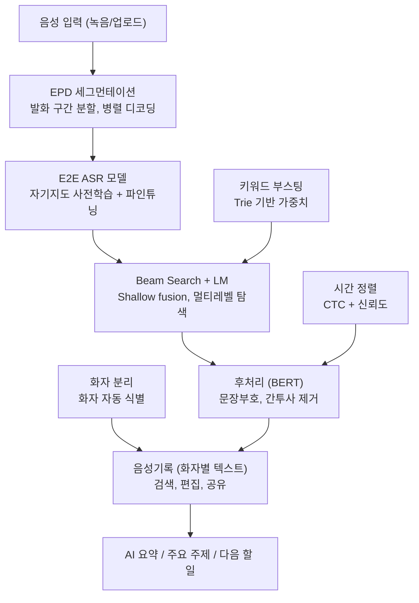

# 클로바노트(CLOVA Note) 음성 처리 흐름 — 벤치마크 레퍼런스

> 목적: 자체 STT/음성 기록 서비스(Damwha) 설계 시 벤치마크용. 클로바노트가 음성
> 데이터를 어떤 파이프라인으로 처리하는지, 자체 구현과 어디가 같고 다른지 정리.
> 작성일: 2026-07-23 (2026-07-23 엔진 파이프라인 상세 보강)

## 1. 개요

- 네이버가 2020년 출시한 AI 음성 기록 서비스. "AI 음성 기록" 이름으로 시작.
- 음성을 텍스트로 변환(STT) + 화자분리 + AI 요약을 결합한 제품.
- 백엔드 STT 엔진 = **CLOVA Speech** (NAVER Cloud Platform 상용 API와 동일 계열).
- 핵심 인식 기술 = **NEST** (Neural End-to-end Speech Transcriber).
  - 긴 비정형 문장 전사에 강한 end-to-end 엔진.
- 자연어 처리 / 요약 = 하이퍼클로바(HyperCLOVA) 계열 사용.

엔진 레벨 구조:
`음성신호 → E2E ASR 모델 → Beam Search Decoder(+Language Model) → Post-Processing → 인식결과`

## 2. 전체 파이프라인 다이어그램



## 3. 엔진 단계별 상세

### 3.1 입력 수집
현장 녹음 또는 음성 파일 업로드 두 방식으로 입력. 업로드 후 몇 분 안에 **배치 처리**로
텍스트 변환 완료.

### 3.2 세그먼테이션 (EPD/VAD)
End Point Detection으로 오디오를 segment 단위로 분할한 뒤, 각 segment를
**멀티스레딩/멀티프로세싱 기반 병렬 Beam Decoder**로 동시 디코딩. 긴 회의 녹음을 빠르게
처리하는 핵심이 이 **병렬 디코딩 구조**.

### 3.3 E2E ASR (음향 모델)
전통적 DNN-HMM 대신 End-to-End 신경망. 학습 방식이 특징적:
- **wav2vec 2.0 스타일 자기지도 학습(SSL)** 으로 Transformer 인코더를 대량 무전사 오디오만으로
  사전학습.
- 소량 speech-text pair 데이터로 지도학습 파인튜닝.
- 학습 안정화: VAD로 speech 구간만 선별 + warm-up scheduler + multi-node multi-GPU 분산학습.

### 3.4 언어모델 결합 (Beam Search)
LM이 문법/단어 빈도/문장 구조를 이해해 인식 결과 보완.
- **Shallow Fusion**: ASR 모델 확률 + LM 확률을 합쳐 Beam Search 수행.
- ASR은 **character 단위**, LM은 **word 단위**라 vocab이 다름.
- **Multi-level Beam Search**: character LM으로 탐색하다 단어 완성 시 word LM 점수로 치환.

### 3.5 Keyword Boosting ★벤치마크 주목
사전에 주요 단어 리스트를 받아 **token 단위 trie(prefix tree)** 로 구성. beam search 과정에서
해당 단어 포함 path의 점수를 가산.
- 정확도(CRR)는 큰 차이 없음.
- 키워드 **Recall 유의미 향상**, 약간의 **Precision loss** 발생.
- 사용자 노출: '설정 > 자주 쓰는 단어' 등록 기능.

### 3.6 Post-Processing
가독성 향상 후처리:
- Punctuation (문장부호)
- Truecasing (대문자화)
- Disfluency Removal (간투사 제거)

**Multilingual BERT** 기반으로 각 토큰에 comma/period/capital/disfluency 등 레이블 부여.

### 3.7 Time Alignment & Confidence
- **CTC output**에서 단어별 시간 정보 추출 (자막 등 활용).
- ASR 확률 기반 인식 결과 신뢰도 제공, 노이즈 여부 판별.

### 3.8 화자 분리 및 상위 기능
음성 인식 위에 화자 인식 + 주요 키워드 추출 + 회의록 요약이 얹힘.
- 비즈니스용(네이버웍스) **화자 자동 식별**: 주소록 참석자를 한 번만 지정하면 AI가 목소리를
  기억하고, 이후 회의에서 동일 목소리를 인식해 참석자 이름 자동 표시.
- **voiceprint 벡터 기반 화자 식별과 정확히 같은 접근** (Damwha가 채택 중인 방식과 동일).

## 4. 제품/서비스 레벨 처리 모드 (CLOVA Speech API 기준)

오디오 길이/실시간 요구에 따라 3가지 모드. 클로바노트 회의/강의 기록 = **Async long
sentence** 모드가 핵심.

| 모드 | 용도 | 제한 | 프로토콜 |
|------|------|------|----------|
| Sync (short) | 짧은 발화 실시간 | 최대 60초 | REST |
| Async (long sentence) | 긴 파일/회의 녹음 | 장문 배치 | REST + callback |
| Streaming | 라이브 실시간 인식 | - | gRPC |

### 파일 제출 방식 (long sentence)
1. **Object Storage** — NCP 오브젝트 스토리지 미디어 URL
2. **External URL** — 공개 접근 가능 오디오 URL
3. **Local File** — 직접 업로드 (multipart)

### 비동기 잡 흐름
```
1. POST 요청 (completion: "async")
2. 즉시 응답 { "result": "SUCCEEDED", "token": ... }   <- 접수만, 인식 안 끝남
3. 서버 측 비동기 처리
4. 결과 전달: callback URL webhook  또는  resultToObs=true 면 오브젝트 스토리지 저장
5. token 으로 job status 폴링 (SUCCEEDED / PROCESSING / ERROR_*)
```

### 주요 요청 파라미터

| 파라미터 | 설명 |
|----------|------|
| `dataKey` (필수) | Object Storage 파일 경로 |
| `language` (필수) | ko-KR, en-US, enko, ja, zh-cn, zh-tw |
| `completion` | sync / async |
| `wordAlignment` | 단어-음성 정렬 (타임스탬프) |
| `fullText` | 전체 전사 텍스트 출력 |
| `format` | JSON / SRT / SMI |
| `diarization.enable` | 화자분리 on/off |
| `diarization.speakerCountMin/Max` | 화자 수 범위 |
| `sed.enable` | Sound Event Detection (음악/무음 등) |
| `noiseFiltering` | 배경 잡음 제거 |
| `boostings` | 키워드+가중치 배열 (3.5 Keyword Boosting의 API 노출) |
| `forbiddens` | 금칙어/민감어 억제 |
| `callback` | 결과 webhook URL |
| `resultToObs` | 결과 오브젝트 스토리지 저장 |

### 응답 구조
```jsonc
{
  "text": "전체 전사",
  "confidence": 0.0-1.0,
  "speakers": [{ "label": "1", "name": "..." }],
  "segments": [
    {
      "start": 1200, "end": 4300,          // ms
      "text": "발화 내용", "confidence": 0.0-1.0,
      "diarization": { "label": "1" },      // 화자 라벨
      "words": [[1200, 1500, "단어"]]        // [start_ms, end_ms, text]
    }
  ],
  "events": []                              // SED: 음악/무음 등
}
```

## 5. Damwha 매핑 및 차이 (벤치마크 핵심)

| 클로바 단계 | Damwha 대응 | 상태/차이 |
|---|---|---|
| 입력 수집 (배치) | API 업로드 + `job` enqueue → worker 배치 | **일치** |
| EPD/VAD 세그먼테이션 + 병렬 디코딩 | Silero VAD → `clip_timestamps` (발화 구간만 디코딩, 2026-07-23) | 부분. speech-only 디코딩은 반영. **병렬 Beam 디코딩 없음** — supervisor는 job당 자식 1개 직렬 |
| E2E ASR (wav2vec2 SSL + 파인튜닝) | Whisper (mlx / faster-whisper) | 다름. **사전학습 모델 그대로 사용**, 자체 SSL 학습 없음 |
| Beam Search + LM (Shallow Fusion, Multi-level) | Whisper 내부 beam search | 다름. **외부 LM shallow fusion / multi-level beam 없음** |
| Keyword Boosting (trie) | 없음 | **최대 갭**. Whisper `initial_prompt`/hotwords로 근사 가능. 도메인 용어 recall 개선 여지 |
| Post-Processing (BERT punct/truecase/disfluency) | Whisper 네이티브 문장부호 | 부분. 문장부호만 커버. **truecasing/간투사 제거 별도 단계 없음** |
| Time Alignment & Confidence (CTC) | Whisper word timestamp → midpoint align, `utterance.confidence` | **일치** (CTC 대신 Whisper word timestamp) |
| 화자 분리 | pyannote diarization | **일치** |
| 화자 자동 식별 (voiceprint) | ECAPA 192-d voiceprint + pgvector cosine + provisional speaker 자동 생성 | **핵심 일치**. 클로바 '화자 자동 식별'과 동일 접근 |
| AI 요약 / 주요 주제 / 다음 할 일 | `extract_lenses` (로컬 LLM) + lenses | **일치** |

## 6. 벤치마크 시사점 (자체 설계용)

1. **병렬 세그먼트 디코딩** — 클로바 처리 속도의 핵심. Damwha는 현재 직렬 1건(GPU 메모리 격리
   목적). 긴 회의 지연 개선 시 segment 병렬화가 후보이나, 프로세스 격리(OOM 방지)와 트레이드오프.
2. **Keyword Boosting** — 현재 최대 갭. 도메인 고유명사 recall 향상 효과 명확(약간의 precision
   loss 감수). Whisper hotwords / `initial_prompt` 또는 사용자 사전 등록 기능으로 도입 검토 가치.
3. **Post-processing 레이어** — 문장부호는 Whisper 커버, truecasing/간투사 제거는 별도. 가독성
   요구 높아지면 경량 BERT 후처리 고려.
4. **비동기 잡 + 콜백** — 긴 오디오는 토큰 발급 후 워커 처리, 완료 시 webhook/폴링. Damwha
   worker 아키텍처와 정합.
5. **이중 타임스탬프** — segment(문장) + word(단어). 텍스트 클릭 재생 UI 근거.
6. **화자 자동 식별** — Damwha가 이미 클로바(네이버웍스)와 동일한 voiceprint 벡터 접근 채택.
   방향성 검증됨.

## 7. 출처

- [NAVER, CLOVA Note 공식 출시 발표](https://navercorp.com/en/media/pressReleasesDetail?seq=31353)
- [CLOVA Speech overview (NCP API docs)](https://api.ncloud-docs.com/docs/en/ai-application-service-clovaspeech)
- [Object Storage file recognition (long sentence)](https://api.ncloud-docs.com/docs/en/ai-application-service-clovaspeech-longsentence)
- [Check job status (async)](https://api.ncloud-docs.com/docs/en/ai-application-service-clovaspeech-longsentence-getjobstatus)
- [CLOVA Speech real-time streaming API (gRPC)](https://api.ncloud-docs.com/docs/en/ai-application-service-clovaspeech-grpc)
- [CLOVA Speech Recognition (CSR) overview](https://api.ncloud-docs.com/docs/en/ai-naver-clovaspeechrecognition)
- [액션파워 — STT 전처리(VAD/Enhancement/Diarization) 설명](https://actionpower.medium.com/%EC%9D%8C%EC%84%B1%EC%9D%B8%EC%8B%9D-2-stt-speech-to-text-f84a40c8302a)
- [NAVER CLOVA DIHARD3 화자분리 시스템 논문](https://dihardchallenge.github.io/dihard3/system_descriptions/dihard3_system_description_team73.pdf)
