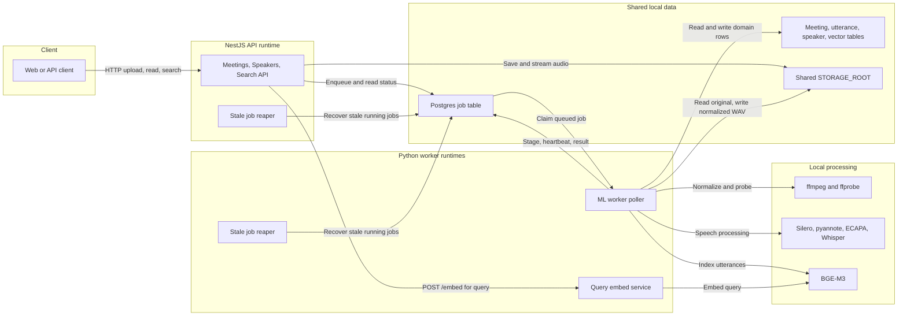
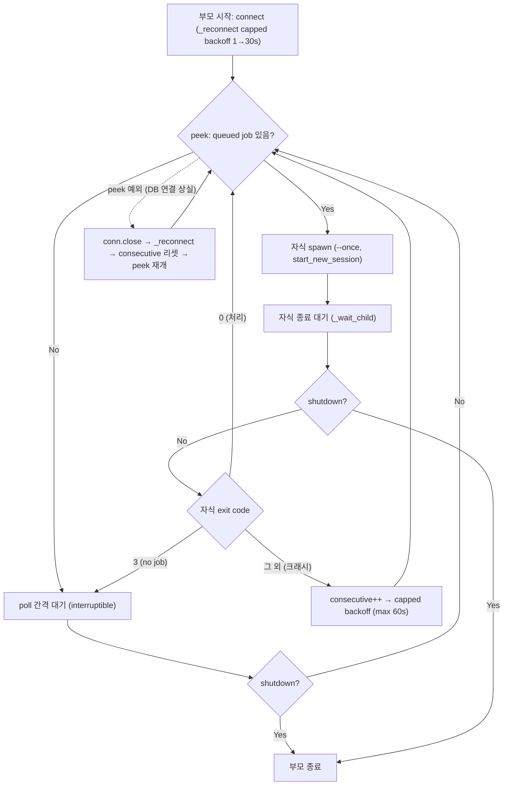
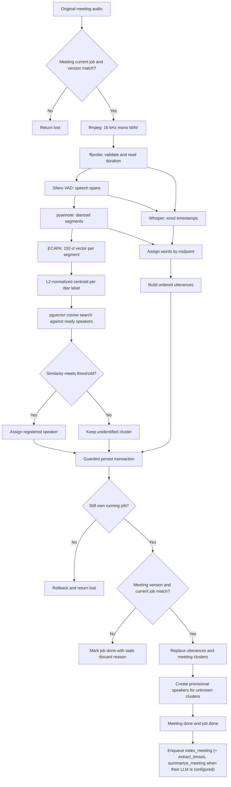
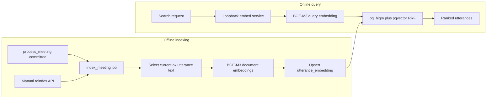
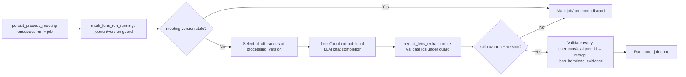
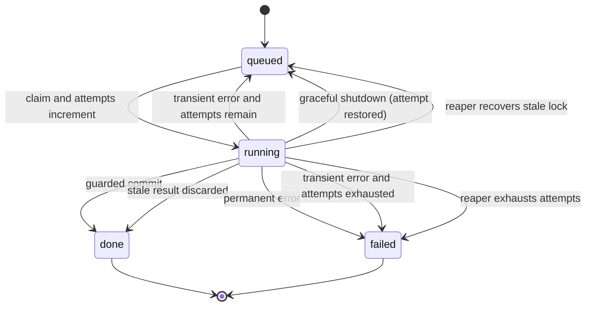

# Damwha Worker 아키텍처와 처리 흐름

> 문서 성격: 현재 구현을 설명하는 살아있는 문서
> 기준일: 2026-07-24
> 범위: `be/worker`, 워커와 직접 연결되는 NestJS job enqueue/reaper, Postgres, 공유 스토리지

## 1. 한눈에 보기

Damwha의 워커 영역에는 서로 다른 두 실행 프로세스가 있다.

1. **ML worker poller** — `python -m damwha_worker`로 실행한다. HTTP 요청을 받지 않고 Postgres `job` 테이블에서 작업을 가져와 회의 처리, 화자 등록, 검색 색인, 렌즈(action/decision/promise) 추출을 수행한다. 내부적으로 `python -m damwha_worker`는 **supervisor 부모**를 띄운다. 부모는 torch/pyannote를 import하지 않고 `job` 큐를 peek만 하며, 처리 대기 job이 있으면 자식 `python -m damwha_worker --once`를 spawn(`start_new_session=True`)하고 종료를 기다린다. 자식은 job 1건을 claim→heartbeat→dispatch로 처리한 뒤 exit하고, OS가 자식의 GPU 메모리(MLX·torch)를 전부 회수한다 — 이것이 job 간 MPS 메모리 누적으로 인한 OOM을 막는 핵심이다. 모델 adapter import도 claim 뒤 dispatch 시점에 일어나므로 의존성 누락은 해당 job의 영구 실패로 기록된다. 자식 exit code(0=처리, 3=no job, 그 외=크래시)로 부모가 분기하며, process-level 크래시는 capped backoff로 스로틀한다. 자식 내부의 heartbeat 스레드는 기존과 동일하게 별도 DB 연결로 `locked_at`을 갱신하며 연결 실패에서도 회복된다. graceful shutdown은 부모가 자식에 SIGTERM을 전달해 자식의 stage-boundary 종료 로직을 태우고, 2차 시그널은 자식을 SIGKILL한다.
2. **Query embed service** — `uvicorn damwha_worker.embed_service:app`으로 실행한다. NestJS 검색 API의 질의 텍스트를 BGE-M3 벡터로 변환하는 loopback 전용 HTTP 서비스다.

NestJS API와 ML worker poller 사이에는 HTTP 호출이 없다. 둘의 비동기 계약은 Postgres `job` 행과 payload이며, 오디오 파일은 같은 `STORAGE_ROOT`를 통해 공유한다.

### 제공 기능

| 기능 | job 또는 서비스 | 핵심 결과 |
|---|---|---|
| 회의 음성 처리 | `process_meeting` | 정규화 음원, 화자별 발언 `utterance`, 미확인 화자 cluster/임시 화자, 후속 색인 job |
| 등록 화자 성문 생성 | `enroll_speaker` | ECAPA 192차원 `voiceprint`, 화자 상태 `ready` |
| 발언 의미검색 색인 | `index_meeting` | BGE-M3 1024차원 `utterance_embedding` |
| 렌즈 항목 추출 | `extract_lenses` | 로컬 LLM으로 action/decision/promise `lens_item`과 `lens_evidence` |
| 회의 요약 생성 | `summarize_meeting` | 로컬 LLM으로 회의 전체 요약 `meeting_summary`(topics/segments) |
| 검색 질의 임베딩 | `POST /embed` | 검색어의 BGE-M3 1024차원 벡터 |
| 실시간 녹음 | `live_session` | 마이크 캡처 WAV, 미리보기 `live_utterance`, 종료 시 `process_meeting` 자동 큐잉 |
| 작업 생명주기 | supervisor 부모 + job당 자식 | 원자적 claim, stage/progress, heartbeat, retry/fail, stale 결과 폐기 |

## 2. 시스템 컨텍스트



핵심 경계는 다음과 같다.

- **API의 책임**: 업로드, metadata CRUD, job enqueue, 상태/결과 조회, stale job reaper.
- **worker poller의 책임**: job claim 이후 모델 실행, stage/progress, 결과 저장, 정상/오류 상태 전이, API와 중복 안전한 stale job reaper.
- **Postgres의 책임**: queue와 결과 저장소를 동시에 담당한다. 별도 Kafka, Redis, RabbitMQ는 없다.
- **공유 파일시스템의 책임**: API가 저장한 원본 오디오를 worker가 읽고 정규화 WAV를 같은 root에 기록한다.
- **embed service의 책임**: 검색 시점의 질의 벡터만 제공한다. job을 claim하거나 회의 상태를 변경하지 않는다.

## 3. Worker 내부 구성

| 영역 | 파일 | 책임 |
|---|---|---|
| 프로세스 진입점/dispatcher | [`worker/damwha_worker/__main__.py`](../worker/damwha_worker/__main__.py) | supervisor 부모(`run_supervisor`)의 peek/spawn/backoff, 자식(`run_single_job`, `--once`)의 claim→dispatch, job type 분기, 필요한 모델의 지연 생성, heartbeat 범위, 2단계 시그널, 공통 오류 처리 |
| payload 계약 | [`worker/damwha_worker/contracts.py`](../worker/damwha_worker/contracts.py) | Pydantic 검증, `schema_version=1`, readable ID 형식 검증 |
| DB adapter | [`worker/damwha_worker/db.py`](../worker/damwha_worker/db.py) | raw SQL claim/heartbeat/stage/requeue/fail/persist, ownership/stale guard |
| stale reaper | [`worker/damwha_worker/reaper.py`](../worker/damwha_worker/reaper.py) | 별도 DB 연결으로 stale recovery를 주기 실행; API reaper와 `SKIP LOCKED`로 공존 |
| heartbeat | [`worker/damwha_worker/heartbeat.py`](../worker/damwha_worker/heartbeat.py) | 별도 DB 연결과 daemon thread로 `locked_at` 갱신 |
| storage | [`worker/damwha_worker/storage.py`](../worker/damwha_worker/storage.py) | 상대 key를 root 내부 경로로 안전하게 변환, traversal 차단 |
| 오류 정책 | [`worker/damwha_worker/errors.py`](../worker/damwha_worker/errors.py) | 영구/일시 오류 분류와 `job.error` JSON 생성 |
| 모델 protocol | [`worker/damwha_worker/models/base.py`](../worker/damwha_worker/models/base.py) | VAD, diarizer, speaker embedder, transcriber, text embedder 인터페이스 |
| 모델 조립 | [`worker/damwha_worker/models/registry.py`](../worker/damwha_worker/models/registry.py) | payload와 settings에 따라 실제 adapter 생성 |
| 회의 처리 | [`worker/damwha_worker/pipeline/process_meeting.py`](../worker/damwha_worker/pipeline/process_meeting.py) | normalize부터 결과 persist까지 orchestration |
| 화자 등록 | [`worker/damwha_worker/pipeline/enroll_speaker.py`](../worker/damwha_worker/pipeline/enroll_speaker.py) | 등록 음원 전체의 성문 추출과 persist |
| 검색 색인 | [`worker/damwha_worker/pipeline/index_meeting.py`](../worker/damwha_worker/pipeline/index_meeting.py) | 정상 발언 텍스트 임베딩과 upsert |
| 렌즈 추출 | [`worker/damwha_worker/pipeline/extract_lenses.py`](../worker/damwha_worker/pipeline/extract_lenses.py) | `ok` 발언 조회 → LLM 후보 추출 → run/version guard로 persist |
| 렌즈 LLM adapter | [`worker/damwha_worker/lens_client.py`](../worker/damwha_worker/lens_client.py) | 로컬 OpenAI-호환 chat completion 호출, 응답 검증/분류 |
| 회의 요약 | [`worker/damwha_worker/pipeline/summarize_meeting.py`](../worker/damwha_worker/pipeline/summarize_meeting.py) | `ok` 발언 조회 → LLM 요약 → 경계 utterance id를 DB 시간으로 검증(`_resolve_segments`) → 통째 persist |
| 요약 LLM adapter | [`worker/damwha_worker/summary_client.py`](../worker/damwha_worker/summary_client.py) | 로컬 OpenAI-호환 chat completion 호출, 응답 검증/분류(렌즈 adapter와 동일 패턴) |
| 검색 질의 서비스 | [`worker/damwha_worker/embed_service.py`](../worker/damwha_worker/embed_service.py) | `/health`, `/embed` FastAPI endpoint |

모델은 protocol 뒤에 격리되어 있다. 그래서 pipeline과 DB glue 테스트는 fake 모델로 결정적으로 실행하고, 무겁거나 gated인 실제 모델은 로컬 smoke에서만 검증한다.

## 4. 공통 job 처리 흐름

처리 단위는 **supervisor 자식 프로세스**(`python -m damwha_worker --once`)이며, 자식은 job을 **정확히 1건** 처리하고 exit한다. 부모는 자식을 한 번 spawn하고 종료를 기다렸다가 exit code에 따라 분기한다(0=처리 완료, 3=no job, 그 외=크래시→capped backoff). 큐 polling(대기 후 재시도)은 자식이 아니라 **부모의 peek 루프**가 담당한다(아래 "복원력과 우아한 종료" 참고).

```mermaid
flowchart TD
    start["Child process (--once) starts"] --> load["Load settings, install SIGINT/SIGTERM handlers"]
    load --> connect["Connect DB (connect_fn, fail-fast — 자식은 재접속 안 함)"]
    connect --> claim["Claim oldest queued job with SKIP LOCKED"]
    claim --> found{"Job found?"}
    found -->|"No"| exit3["Exit 3 (no job) — 부모가 poll 간격 대기"]
    found -->|"Yes"| beat["Start heartbeat on a separate DB connection"]
    beat --> validate["Validate schema version and payload"]
    validate --> route{"Job type"}

    route -->|"process_meeting"| process["Build speech models and process meeting"]
    route -->|"enroll_speaker"| enroll["Build ECAPA embedder and enroll speaker"]
    route -->|"index_meeting"| index["Build BGE-M3 and index utterances"]
    route -->|"extract_lenses"| lenses["Build lens LLM client and extract lenses"]

    process --> outcome{"Outcome"}
    enroll --> outcome
    index --> outcome
    lenses --> outcome

    outcome -->|"Committed"| done["Job done, progress 100"]
    outcome -->|"Stale"| discarded["Job done with discard reason"]
    outcome -->|"Ownership lost"| lost["Stop without writing shared state"]
    outcome -->|"Shutdown requested"| shutReq["Requeue for shutdown (attempts − 1)"]

    validate -.->|"Exception"| classify["Classify error"]
    process -.->|"Exception"| classify
    enroll -.->|"Exception"| classify
    index -.->|"Exception"| classify
    lenses -.->|"Exception"| classify
    classify --> retry{"Transient and attempts remain?"}
    retry -->|"Yes"| requeue["Return job to queued"]
    retry -->|"No"| failed["Fail job and related entity when applicable"]

    done --> exit0["Stop heartbeat → exit 0"]
    discarded --> exit0
    lost --> exit0
    shutReq --> exit0
    requeue --> exit0
    failed --> exit0

    connect -.->|"connect 실패 / 미포착 예외"| crash["전파 → nonzero exit (부모 backoff / reaper)"]
```



자식은 job 1건을 처리(또는 handle_job 내부 requeue/fail)한 뒤 `exit 0`으로 종료하며, 부모는 대기 없이 즉시 다음 job을 peek→spawn한다. 자식은 재접속하지 않는다 — connect 실패나 미포착 예외는 nonzero로 전파해 부모의 크래시 분기(backoff)나 reaper가 복구한다. 부모의 큐 polling·재접속·우아한 종료는 아래 "복원력과 우아한 종료"에서 다룬다.

### Claim과 순서

- `SELECT ... FOR UPDATE SKIP LOCKED LIMIT 1`을 포함한 단일 `UPDATE ... RETURNING`으로 실행 가능(`next_attempt_at IS NULL OR <= now()`)한 `queued` job을 claim한다. claim은 부모가 아니라 자식이 수행한다(락 소유권이 프로세스 경계를 넘지 못하므로 부모는 가벼운 `peek`만 하고 claim은 자식에게 맡긴다).
- 부모의 `peek_queued`는 `status='queued'` 존재만 확인하고 **`next_attempt_at`은 보지 않는다**(claim만 필터). 그래서 delayed transient-retry job만 남아 있으면 부모는 poll 간격마다 자식을 spawn하지만, 자식 claim이 아직 `next_attempt_at`이 안 지난 job을 건너뛰어 no-job(exit 3)으로 종료하므로 poll 간격으로 자연히 스로틀된다.
- claim 시 `status='running'`, `locked_by`, `locked_at`을 기록하고 `attempts`를 1 증가시킨다.
- type별 priority는 없다. 실행 가능한 job은 `next_attempt_at NULLS FIRST, created_at` 순서로 같은 queue를 사용한다.
- 자식 프로세스는 job을 정확히 1건만 처리한다. 부모는 자식 하나를 spawn하고 종료를 기다린 뒤에야 다음을 peek하므로, 동시 실행 없이 항상 직렬 1건이다.

### Heartbeat와 reaper

- 모델 추론이 메인 thread를 오래 점유하므로 heartbeat는 daemon thread와 별도 psycopg 연결을 사용한다.
- heartbeat는 `job.id + locked_by + running` 조건을 만족할 때만 `locked_at`을 갱신한다.
- heartbeat thread는 connect/beat 실패에 죽지 않는다. 실패하면 연결을 닫고 다음 interval에 재접속을 시도하며, 수명은 해당 job 처리 범위에 한정된다.
- NestJS reaper와 worker supervisor reaper가 모두 5분마다 오래된 `running` job을 찾는다. 둘은 `FOR UPDATE SKIP LOCKED`를 사용하므로 같은 job을 중복 전이시키지 않는다.
- 시도 횟수가 남으면 `queued`와 `next_attempt_at=NULL`으로 되돌리고, 소진되면 `failed`로 바꾼다. `process_meeting`은 meeting, `enroll_speaker`는 speaker에도 실패를 전파한다. `index_meeting`·`extract_lenses`·`summarize_meeting` 실패는 meeting을 실패시키지 않는다(`extract_lenses`는 `lens_extraction_run`만, `summarize_meeting`은 `meeting_summary`만 실패로 표시) — 두 reaper 구현(`db.reap_stale`, `jobs.repository.ts`의 `reapStale`) 모두 `fail_lens_extraction_runs`와 `fail_summaries` CTE를 갖고 있어야 하며, 한쪽만 고치면 그 job type의 reap 경로가 어긋난다.

### 복원력과 우아한 종료

부모의 peek 루프는 어떤 예외에도 죽지 않고(peek 실패는 재접속으로 회복), 자식의 exit code를 보고 결정적 오류(예: 손상 음원, import/config 실패)를 감지해 capped backoff로 무한 재spawn을 방지한다. 자식은 시그널을 받으면 stage 경계에서 우아하게 멈춘다.



- **초기 연결**: 부모의 DB 연결은 `_reconnect`로 capped 지수 backoff(1→30초)를 재시도한다. 연결 전에 종료 시그널을 받으면 job을 잡지 않고 즉시 종료한다. 자식은 이와 달리 `connect_fn()`을 직접 호출하는 fail-fast로, connect 실패를 nonzero exit로 전파한다.
- **자식 크래시와 backoff**: 자식이 nonzero로 종료하면(connect 실패, import/config 오류, 미포착 예외) 부모는 크래시로 보고 poll 간격부터 capped exponential backoff(max 60초)로 재spawn을 스로틀한다. claim **후** 크래시면 `attempts`가 올라가 있어 reaper가 소진 시 fail + meeting/speaker 전파를 담당하고, claim **전** 크래시(결정적 오류)면 job이 `queued`로 남아 backoff가 무한 spawn을 막는다. **자식은 재접속하지 않는다** — 옛 poll-loop의 in-flight requeue는 제거됐고, DB 연결 상실은 자식 크래시→reaper와 부모 peek 예외→`_reconnect`로 나뉘어 처리된다.
- **우아한 종료**: SIGINT/SIGTERM은 shutdown Event를 set한다. 각 pipeline은 stage 경계마다(`enter_stage`, `process_meeting`은 mark_processing/normalize 이전에도) 이를 확인해 `ShutdownRequested`를 던지고, `db.requeue_for_shutdown`으로 job을 `queued`로 되돌린다. 이때 attempts를 1 줄여(outcome `requeued_shutdown`) 우아한 정지가 시도를 소비하지 않게 한다. 우아한 정지로 job을 `queued`로 되돌린 자식은 정상 처리 경로를 거쳐 `exit 0`으로 종료하고(§1의 exit code 분류와 일치), 부모는 다음 peek로 넘어간다. 2차 시그널은 부모가 자식을 SIGKILL한 뒤 `os._exit(1)`로 종료하며, 미처 되돌리지 못한 job은 reaper가 복구한다. 대기(idle) 중 종료는 즉시 빠져나간다.
- **stage 경계 소유권 guard**: `enter_stage`는 `process_meeting`뿐 아니라 `enroll_speaker`/`index_meeting`에도 job 소유권을 확인시킨다. 소유권을 잃으면 `lost_ownership`(TRANSIENT)로 처리된다.
- **attempts 회계 요약**: crash/transient 오류 = 시도 1회 소비, 우아한 종료 = 소비하지 않음(attempts − 1로 복원), 소진된 in-flight = reaper에게 위임.
- **Heartbeat 재접속**: 자식 내부의 heartbeat 스레드는 별도 DB 연결을 유지하며, 연결/beat 실패 후에도 재접속을 시도해 살아있다. 이는 부모의 재spawn 정책과 독립적으로 in-flight job의 `locked_at`을 계속 갱신한다.

### 라이브 세션 자식

`live_session`을 claim한 자식은 종료 신호까지 산다. 마이크 콜백 → writer 큐(전용 스레드, 스트리밍
헤더 WAV) + preview 큐(상한 5분) → 메인 루프(VAD → 세그먼트 → whisper → ECAPA 식별 → `live_utterance`).
1초마다 `job.stop_requested_at`·소유권·shutdown·상한 시간을 본다.

**종료 순서가 뒤바뀌면 안 된다.** 캡처 스레드를 join한 **뒤에야** writer 스레드에 종료 신호(sentinel)를
보낸다 — 정상 종료와 예외 경로 모두 마찬가지다. 실제 마이크는 콜백이 소비자보다 앞서 버퍼를 채우므로
`stop()` 뒤에도 한동안 프레임이 계속 나온다. 순서를 바꿔 writer를 먼저 끝내면 그 직후 캡처가 넣는
프레임은 아무도 읽지 않는 큐에 쌓인 채 사라진다 — 순서를 되돌리는 회귀 테스트에서 130프레임 중 57개가
이렇게 사라지는 것으로 확인했다. writer 스레드가 죽으면(디스크 풀 등) 그 오류를 캡처 스레드의 오류와
동등하게 취급해 finalize 직전에 검사하고, 세션을 PERMANENT `io_error`로 실패시킨다 — 조용히 넘기면
사용자가 실제로 녹음한 것보다 짧게 잘린 파일이(`duration_ms`도 디스크에 닿은 바이트 기준이라
똑같이 짧게 찍힌 채) 아무 표시 없이 "완료된 회의"가 된다. 프레임을 한 개도 못 잡은 세션은
`discarded`로 끝내지 않고 PERMANENT `audio_device_failed`로 실패한다 — `discarded`는 어떤 job도
완료 처리하지 않는 경로라 회의가 `recording`에 그대로 남고, `meeting_single_recording_idx`가 동시
녹음을 하나로 제한하므로 그 상태가 이후의 모든 녹음 시작을 영영 막게 된다. `MicSource`의 stop 신호
큐는 `frames()`가 아니라 생성자에서 만든다 — 캡처가 시작되기도 전에 `stop()`이 먼저 오는 취소
경쟁에서도 신호가 버려지지 않게 하기 위해서다.

종료 순서 요약: 캡처 닫기 → writer join → 마지막 발화 처리 → finalize(회의 `uploaded`, payload의
v5 `process_meeting` 큐잉). 재시도 없음, 1차 SIGTERM은 finalize. 상세:
`docs/superpowers/specs/2026-09-05-live-recording-design.md`.

**세그먼트 끝 → 미리보기 노출 지연은 설계 예상(1~2초)보다 훨씬 크다.** `smoke_live_session.py`
실측(중앙값 5.1초, 최대 7.4초, `worker/SMOKE.md` "라이브 세션" 실측 참고)이 large-v3-turbo(mlx,
GPU)로 15초 세그먼트 하나를 처리하는 실제 시간을 보여준다. 이 격차는 설계 §2.7이 SSE를 뺀
근거(폴링 오버헤드는 전사 시간 옆에서 작다)를 **약화시키지 않는다** — 전사가 예상보다 느릴수록
1초 폴링이 얹는 평균 0.5초의 비중은 오히려 더 작아지므로(1.5초 기준 1/3 → 5초 기준 1/10),
전송 방식을 바꿀 이유는 더 줄었다. 표본이 4개뿐이고 세션 안에서 지연이 단조 증가했다는 점은
`SMOKE.md`에 남겨 뒀다 — 재측정 전까지 정착된 값으로 보지 않는다.

## 5. Job 타입별 계약

| job type | 주요 payload | DB stage와 progress | 성공 결과 |
|---|---|---|---|
| `process_meeting` | meeting/audio key, processing version, 모델 snapshot, 식별 threshold | `vad` 15 → `diarize` 35 → `identify` 50 → `stt` 75 → `align` 90 → `persist` 95 → done 100 | meeting과 발언 저장, 미확인 화자 처리, `index_meeting` enqueue |
| `enroll_speaker` | speaker/audio key, embedding model/dimension | `extract_embedding` 30 → `enroll_persist` 80 → done 100 | `voiceprint` 생성, speaker `ready` |
| `index_meeting` | meeting, processing version, search model/dimension | `embed` 20 → done 100 | 발언별 `utterance_embedding` upsert |
| `extract_lenses` | meeting, processing version, `extraction_run_id`, LLM model | `extract_lenses` 30 → `persist_lenses` 80 → done 100 | LLM 후보를 검증·병합한 `lens_item`/`lens_evidence` |
| `summarize_meeting` | meeting, processing version, 요약 LLM model | `summarize_meeting` 30 → `persist_summary` 80 → done 100 | 회의당 1행 `meeting_summary`(topics/segments)를 통째로 교체 |

공통 payload는 `schema_version`을 갖고, 허용 버전은 **job type별**로 다르다(`SUPPORTED_SCHEMA_VERSIONS`, `contracts.py`). `process_meeting`은 **v1, v2, v3**를, `enroll_speaker`/`index_meeting`/`extract_lenses`/`summarize_meeting`은 **v1**만 받는다. v2 `process_meeting`은 stage별 device(`models.devices.{diarization,stt}` = `cpu`|`gpu`)와 `preset`/`preset_revision` 참조 정보를 추가하고, **v3**는 여기에 처리 프리셋이 고른 요약 LLM `models.summary_model`을 더한다(wire v3에서는 필수). worker는 v1/v2/v3 payload를 각각 `_v1_models_to_internal`(`device=mps→gpu`, `cpu→cpu`, `cuda→cpu`+경고)/`_v2_models_to_internal`/`_v3_models_to_internal`로 정규화된 내부 shape `ModelsConfig`로 변환하므로 downstream은 항상 하나의 shape만 본다 — v1/v2 유래 payload는 `summary_model=None`이 되고 워커가 env(`summary_llm_model`)로 폴백한다. API의 Zod 계약과 worker의 Pydantic 계약이 같은 fixture를 검증해 drift를 차단한다.

## 6. `process_meeting` 상세 흐름



### 단계별 의미

1. **처리 시작 guard** — meeting의 `current_job_id`와 `processing_version`이 payload와 일치할 때만 `processing`으로 바꾼다.
2. **정규화/검증** — 원본을 임시 sibling path의 16 kHz mono WAV로 만든 뒤 ffprobe가 성공하면 `os.replace()`로 원자적으로 publish한다. 이미 publish된 정규화 파일이 있으면 재사용하며, ffprobe는 항상 duration을 읽는다. 손상 음원과 probe 실패는 영구 오류다.
3. **VAD** — 음성이 존재하는 구간을 구한다. 이 span은 (a) `prepare_stt_spans`(pad ±200ms → clamp → merge)를 거쳐 STT의 `clip_timestamps` 입력이 되고, (b) 원본 그대로 align 단계에서 `transcribe_failed`와 `silence`를 구분하는 데 사용된다.
4. **Diarization** — pyannote가 시간 구간별 `diar_label`을 만든다.
5. **Speaker embedding/identification** — ECAPA가 각 구간을 192차원으로 바꾸고 label별 centroid를 만든다. 같은 model/dimension이면서 `speaker.enrollment_status='ready'`인 voiceprint만 cosine 비교한다.
6. **STT** — payload의 Whisper 모델과 language로 word timestamp를 생성한다. VAD 발화 구간만 디코딩하며(`clip_timestamps`, 무음 환각 방지), VAD가 비면 STT 호출을 생략한다. 두 어댑터 모두 `condition_on_previous_text=False`, `hallucination_silence_threshold=2.0`을 고정하고, 출력을 `drop_repetition_loops`(`pipeline/stt_repetition.py`)로 거른다 — decode 파라미터로는 막을 수 없는 디코더 축퇴(같은 토큰을 `sample_len=224` 상한까지 반복)를 걷어내는 후처리이며, upstream 로직이 같은 faster-whisper에도 동일하게 필요하다(근거는 모듈 주석과 `worker/SMOKE.md` 2026-08-13 실측). **MLX 어댑터는 clip마다 `mlx_whisper.transcribe`를 개별 호출한다** — 다수 clip을 한 번에 넘기면 mlx-whisper의 seek 루프가 일부 clip 출력을 드랍하기 때문(mtg_1 재현·격리 실험으로 확인, 2026-07-24). faster-whisper는 flat 리스트 한 번 호출. Apple Silicon은 MLX, 그 외 환경은 faster-whisper adapter를 선택할 수 있다. stage 로그에 `words/spans/clipped_ms/duration_ms`를 남긴다 — `clipped_ms/duration_ms` 비율이 비정상적으로 낮으면 VAD false negative 의심 신호. **두 가드는 세트로만 유효하다** — 한국어 실측(`worker/SMOKE.md` "STT 품질 측정")에서 `clip_timestamps` 없이 decode 파라미터만 걸면 CER이 3.98% → 7.68%로 악화됐고, clip을 되살려야 5.07%가 됐다. 같은 실측에서 `large-v3`는 `large-v3-turbo` 대비 이점이 없고 런 간 분산만 컸다(무가드에서 8.18%↔21.27%) — 전역 기본 프리셋을 `standard`로 두는 근거.
7. **Align** — word midpoint가 속한 diarization segment에 word를 귀속하고 segment 단위 발언을 만든다. text가 없는 구간도 `silence` 또는 `transcribe_failed` row로 남긴다. 단, **1초 미만 무단어 세그먼트는 row를 만들지 않는다**(`MIN_WORDLESS_SEGMENT_MS=1000`, `align.py`) — 화자 겹침에서 나오는 sub-second diarization 파편이 노이즈 row로 쌓이는 것을 막는다(mtg_1 검증: non-ok row 19→2, 2026-07-24). 단어가 붙은 세그먼트는 길이와 무관하게 유지된다.
8. **Persist** — ML 계산은 transaction 밖에서 수행하고, 최종 결과 교체만 짧은 transaction에서 원자적으로 처리한다. 같은 transaction에서 후속 `index_meeting` job을 enqueue하고, worker에 `lens_llm_model`이 설정돼 있으면 `lens_extraction_run`과 `extract_lenses` job을, `summary_llm_model`이 설정돼 있으면 `summarize_meeting` job을 함께 enqueue한다(각각 설정이 없으면 해당 후속 job을 건너뛴다). `index_meeting`·`extract_lenses`·`summarize_meeting` 세 후속 job은 서로 독립적으로 실행·재시도·실패한다 — 예를 들어 요약이 실패해도 렌즈 항목이나 색인은 영향받지 않고, 그 반대도 마찬가지다.

### 미확인 화자 자동 생성

식별 threshold를 넘지 못한 label은 persist 시 다음과 같이 처리된다.

- `Speaker_NNN` 형식의 `provisional` speaker를 생성한다.
- centroid를 `source='auto_cluster'`인 voiceprint로 저장한다.
- `meeting_cluster.resolved_speaker_id`와 해당 utterance를 임시 speaker에 연결한다.
- 사용자가 이름을 확정하면 API가 `provisional`을 `ready`로 승격한다.
- 재처리로 참조가 사라진 미확정 provisional speaker는 GC한다. `ready` speaker는 삭제하지 않는다.

## 7. `enroll_speaker` 처리 흐름


- 등록에는 VAD, diarization, Whisper가 필요하지 않으며 현재 dispatcher는 전용 `build_embedder`로 ECAPA만 생성한다.
- 샘플 전체를 하나의 segment로 임베딩하므로 10~30초 정도의 깨끗한 단일 화자 음원이 적합하다.
- transaction 안에서 job ownership과 `speaker.current_job_id`를 확인한 뒤 voiceprint insert, speaker `ready`, job `done`을 함께 반영한다.
- 실패 시 job과 speaker가 함께 `failed`가 된다. 더 새로운 등록 job이 speaker를 선점했다면 현재 결과는 `lost`로 폐기한다.

## 8. `index_meeting`과 검색 질의 흐름



### Offline indexing

- 정상 처리된 `process_meeting` transaction이 `index_meeting`을 자동 enqueue한다.
- `POST /meetings/:id/reindex`, `POST /meetings/reindex-missing`으로 수동 enqueue도 가능하다.
- 현재 processing version의 `status='ok'`이고 text가 있는 utterance만 BGE-M3로 변환한다.
- `(utterance_id, model)` unique key로 upsert한다.
- persist 전에 job ownership과 meeting processing version을 확인한다. 새 재처리가 추월했으면 embedding을 쓰지 않고 stale discard한다.
- 색인 실패는 회의 처리 결과를 무효화하지 않는다. meeting은 `done`을 유지하고 keyword 검색은 계속 가능하다.

### Online query embedding

- NestJS Search API는 worker poller가 아니라 별도 `embed_service`의 `POST /embed`를 호출한다.
- 기본 주소는 `127.0.0.1:8100`이며, 비-loopback 주소는 명시적으로 허용하지 않으면 거부된다.
- service 응답의 model, dimension, vector 개수/길이, 유한성을 API가 검증한다.
- timeout, 연결 실패, 계약 불일치 시 keyword-only 검색으로 degrade한다.

주의할 점은 worker의 index job과 embed service가 같은 BGE-M3 adapter를 사용하지만 **서로 다른 프로세스와 모델 인스턴스**라는 것이다.

## 9. `extract_lenses` 처리 흐름

회의 처리 결과에서 action/decision/promise를 뽑아 `lens_item`으로 저장하는 세 번째 job type이다. 로컬 OpenAI-호환 LLM에 발언 텍스트를 보내 후보를 받고, 서버 측에서 다시 검증한 뒤에만 persist한다. 검색 embed service와 마찬가지로 LLM endpoint는 loopback-local이라 외부 네트워크가 없다는 전제를 유지한다.



### 단계별 의미

- **enqueue** — API가 아니라 `persist_process_meeting` transaction이 `lens_extraction_run`(키: `meeting + processing_version`)과 `extract_lenses` job을 함께 만든다. worker에 `lens_llm_model`이 없으면 생략한다. `POST /meetings/:id/lenses/extract` 등 API 측 수동 enqueue도 활성 run을 재사용한다(idempotent).
- **run guard** — `mark_lens_run_running`은 job 소유권(`locked_by`+`running`), run↔job 연결, `meeting.processing_version`이 payload와 일치할 때만 run을 `running`으로 바꾼다. 버전이 stale하면 job/run을 `done`으로 닫고 `discarded`, 소유권을 잃었으면 `lost`.
- **select** — 현재 `processing_version`의 `status='ok'`이고 text가 있는 발언만 order 순으로 읽어 화자 이름과 함께 LLM에 넘긴다.
- **LLM 서버 기동** — `LENS_LLM_MANAGED=true`(기본)면 자식이 `llm_server.py::managed_llm_server`로 `mlx_lm.server`를 payload의 모델로 띄우고, job이 끝나면 `finally`에서 SIGTERM(무시하면 SIGKILL)으로 내린다. 큐가 빈 동안 모델(8bit 27B ~28GB)이 메모리를 쥐고 있지 않게 하는 것이 목적이고, 대가는 job당 로드 1회다. 이미 떠 있는 서버는 사람이 띄운 것으로 보고 재사용만 하며 죽이지 않는다. 실패는 `llm_server_start_failed`(바이너리 없음·포트 없는 base URL = PERMANENT, 기동 타임아웃·조기 종료 = TRANSIENT).
- **LLM 호출** — `lens_client.py`가 `reasoning_effort=none`, `response_format=json_object`로 chat completion을 호출한다. 기본 endpoint는 `http://127.0.0.1:8000/v1`, 모델 `mlx-community/Qwen3.5-4B-8bit`. **어댑터는 런타임 비의존적이다** — Ollama 의존성은 없고, 로컬 런타임은 `mlx_lm.server`가 HF repo를 직접 서빙한다(설정과 함정은 `worker/SMOKE.md`). code fence로 감싼 응답이나 wrapper 없는 배열도 관대하게 파싱한 뒤 Pydantic으로 검증한다. 로컬 런타임에서 `response_format`은 권고사항이라 모델이 nullable 필드를 생략한다 — `LensCandidate.assignee_speaker_id`/`due_at`은 기본값 `None`이고(생략 = 명시적 null), `extra="forbid"`가 없는 필드 생성은 계속 막는다.
- **persist/재검증** — `persist_lens_extraction`이 동일 guard를 다시 적용하고, 모든 후보의 `primary`/`supporting` utterance id와 `assignee_speaker_id`가 그 meeting·version에 실제 존재하는지 서버 측에서 재확인한다. 하나라도 어긋나면 후보 전체를 커밋하지 않고 영구 오류(`invalid_lens_candidate`)로 실패한다.

### 실패와 격리

- 렌즈 추출 실패는 회의 처리 결과를 무효화하지 않는다. meeting은 `done`을 유지하고 run/job만 실패로 표시한다(`fail_lens_extraction`).
- LLM 오류 분류: 연결 실패·timeout·5xx·408/429는 TRANSIENT(attempts 남으면 requeue), 그 외 4xx와 파싱/검증 실패(`llm_invalid_response`)는 PERMANENT.

## 10. Job 상태와 실패 처리



`lost`와 `requeued_shutdown`은 DB status가 아니라 worker 함수의 outcome이다. `lost`는 이미 job ownership을 잃었으므로 현재 worker는 상태 전이를 하지 않고 중단하며, 새 소유자나 reaper가 DB 상태를 책임진다.

### 오류 분류

| 분류 | 대표 사례 | 처리 |
|---|---|---|
| Permanent | 손상 음원, 지원하지 않는 형식, ffprobe 실패, 지원하지 않는 payload version, 모델 package import 실패, `gpu_unavailable`(MPS 없음), 임베딩 불가할 만큼 짧은 등록 샘플(`sample_too_short`), LLM 4xx·잘못된 응답(`llm_invalid_response`), 검증 실패 lens 후보(`invalid_lens_candidate`) | 즉시 fail |
| Transient | OOM, 분류되지 않은 runtime 오류, LLM 연결 실패·timeout·5xx·408/429(`llm_request_failed`), 기타 일시 장애 | attempts가 남으면 delayed requeue, 아니면 fail |

`job.next_attempt_at`은 transient retry를 지연한다. claim 후 attempt 수에 따라 `min(2^(attempts-1), 60)`초 뒤로 설정되며, claim은 그 시각이 지난 job만 선택한다. 따라서 poison job이 즉시 재claim되어 FIFO 전체를 막지 않는다. transient requeue는 자식의 정상 outcome이라 자식은 `exit 0`으로 종료하고, 부모는 다음 실행 가능한 job을 peek→spawn한다. graceful shutdown과 stale reaper recovery는 `next_attempt_at=NULL`으로 즉시 실행 가능하게 만든다.

## 11. 일관성 모델과 안전장치

이 queue는 crash/reaper/retry 때문에 동일 job이 다시 실행될 수 있는 at-least-once 구조다. 정확성을 위해 결과 저장 시 두 종류의 guard를 사용한다.

### Job ownership guard

```sql
WHERE job.id = :job_id
  AND job.locked_by = :worker_id
  AND job.status = 'running'
```

같은 job이 requeue된 뒤 다른 worker가 다시 claim한 경우, 이전 worker가 늦게 결과를 덮어쓰지 못하게 한다.

### Entity stale guard

- 회의 처리: `meeting.processing_version`과 `meeting.current_job_id`가 payload/job과 일치해야 한다.
- 검색 색인: `meeting.processing_version`이 payload와 일치해야 한다.
- 화자 등록: `speaker.current_job_id`가 현재 job과 일치해야 한다.
- 렌즈 추출: `lens_extraction_run`이 job에 연결돼 있고 run의 `processing_version`이 `meeting.processing_version`과 일치해야 한다.
- 회의 요약: `meeting.processing_version`이 payload와 일치해야 한다(`mark_summary_running`/`persist_summary`). 불일치 시 다른 job type과 달리 job뿐 아니라 `meeting_summary` 행도 함께 `failed`로 닫는다 — 주인 잃은 `running` 행은 reaper의 `fail_summaries` CTE가 *reap된 job*에만 join하므로 구제되지 않고, API의 재생성 조회(`findActive`)는 `status IN ('queued','running')`을 "진행 중"으로 보기 때문에 열어 두면 재생성이 영구히 막힌다.

guard 결과에 따른 의미는 다음과 같다.

| 판정 | outcome | 공유 상태 처리 |
|---|---|---|
| job ownership 없음 | `lost` | transaction rollback, 현재 worker는 아무 상태도 쓰지 않음 |
| job은 소유하지만 meeting version이 stale | `discarded` | meeting/result 무변경, job은 `done`과 discard reason 기록 |
| 모든 guard 통과 | `committed` | entity 결과와 job 완료를 같은 transaction에서 반영 |
| stage 경계에서 종료 시그널 감지 | `requeued_shutdown` | entity 무변경, job은 `queued`로 복귀하고 attempts를 1 되돌림 |

`extract_lenses`와 `summarize_meeting`은 `discarded` 행에서 예외다 — 둘 다 job을 닫을 때 자신의 결과 행도 함께 갱신하지만 목표 상태는 다르다. `extract_lenses`는 `lens_extraction_run.status`를 `done`으로 갱신하고(`mark_lens_run_running` `db.py:670-679`, `persist_lens_extraction` `db.py:710-719`), `summarize_meeting`은 `meeting_summary.status`를 `failed`로 갱신한다(바로 위 "회의 요약" guard 설명 참고) — 재생성이 영구히 막히지 않으려면 `failed`로 명시해야 하기 때문이다. `process_meeting`·`index_meeting`은 표대로 entity를 건드리지 않는다.

## 12. 저장 데이터와 파일

| 저장소 | worker가 읽는 값 | worker가 쓰는 값 |
|---|---|---|
| `job` | type, payload, attempts/max attempts | status, stage, progress, lock, error |
| `meeting` | audio key, current job, processing version | processing/done/failed, normalized key, duration, error |
| `speaker` | ready voiceprint의 소유자, current enroll job | ready/failed/provisional 상태 |
| `voiceprint` | 등록 화자 식별 후보 | enroll 성문, auto-cluster centroid |
| `utterance` | index 대상 text | 시간, 화자, text, confidence, status, version/job stamp |
| `meeting_cluster` | 미식별/수동 resolve 정보 | diar label, centroid, provisional speaker 연결 |
| `utterance_embedding` | 검색용 dense vector | BGE-M3 1024차원 vector와 version/job stamp |
| `lens_extraction_run` | run 상태/버전/job 연결 | run running/done/failed, `job_id`, finished_at, error |
| `lens_item` / `lens_evidence` | 병합 대상 기존 AI 항목 | action/decision/promise 항목과 발언 근거(primary/supporting) |
| `meeting_summary` | 요약 대상 `ok` 발언 | 회의당 1행, topics/segments jsonb, status/job_id/error를 통째로 교체 |
| `STORAGE_ROOT` | 원본 회의/화자 음원 | `meetings/<id>/normalized.wav`, `speakers/<id>/normalized.wav` |

DB에는 상대 storage key만 저장한다. `Storage.resolve()`는 root 밖으로 나가는 absolute path와 `..` traversal을 거부한다.

## 13. 모델과 실행 환경

| 역할 | 구현 | 실행 특성 |
|---|---|---|
| 미디어 정규화/검증 | ffmpeg, ffprobe | 시스템 binary 필요, 16 kHz mono WAV 생성 |
| 음성 구간 탐지 | Silero VAD | PyTorch 계열 |
| 화자 분리 | pyannote.audio | Hugging Face gated 모델과 token/license 필요 |
| 화자 임베딩 | SpeechBrain ECAPA | 192차원, MPS 설정에서도 안정성을 위해 CPU 사용 |
| 음성 인식 | mlx-whisper 또는 faster-whisper | payload `devices.stt`가 선택: `gpu`→MLX(MPS), `cpu`→faster-whisper(int8). `gpu` 요청+MPS 없음은 영구 실패(폴백 없음) |
| 텍스트 임베딩 | BAAI/bge-m3 | 1024차원, index worker와 embed service에서 사용 |
| 렌즈 추출 LLM | 로컬 OpenAI-호환 (기본 `mlx-community/Qwen3.5-4B-8bit`) | loopback endpoint(`127.0.0.1:8000/v1`), `extract_lenses`에서만 사용. 런타임 무관 — `mlx_lm.server` / Ollama 등 무엇이든 가능하나, 요약 모델 카탈로그가 HF repo id라 `mlx_lm.server`가 기본이다. 기본 설정에서 **서버 프로세스는 job 단위로 워커가 띄우고 내린다**(`llm_server.py`) |
| 회의 요약 LLM | 로컬 OpenAI-호환 (기본 `mlx-community/Qwen3.5-4B-8bit`) | 같은 loopback endpoint, `summarize_meeting`에서만 사용. `lens_llm_model`과는 별개의 설정 필드(`summary_llm_model`)다 |

필수 환경은 Python 3.12, `uv`, Postgres 16과 pgvector/pg_bigm, 공유 storage, ffmpeg/ffprobe다. 실제 모델 실행에는 `uv sync --extra models`가 필요하다.

## 14. 실행 순서

```bash
# 모두 모노레포 루트에서 실행한다.
# 1. Postgres
pnpm db:up
pnpm be:migrate

# 2. 검색 질의 embed service
uv run --directory be/worker uvicorn damwha_worker.embed_service:app --host 127.0.0.1 --port 8100

# 3. NestJS API
pnpm be:dev

# 4. ML worker (supervisor 부모 — job마다 자식을 spawn)
pnpm worker
```

`docker compose`는 Postgres만 실행한다. API, worker, embed service는 현재 host 프로세스로 별도 실행한다.

## 15. 현재 구현 특성 및 운영 시 주의점

- worker는 동기 직렬 처리다. supervisor 부모가 자식 하나를 spawn하고 종료를 기다린 뒤에야 다음을 처리하므로, 한 번에 여러 job이 동시 실행되지 않는다.
- 각 job은 별도 자식 프로세스에서 모델 adapter를 새로 생성해 처리하고, 자식이 exit하면 OS가 그 프로세스의 GPU 메모리(MLX·torch)를 전부 회수한다. 이 격리가 job 간 GPU 메모리 누적으로 인한 OOM(특히 16GB Apple Silicon)을 막는 핵심이다. 대신 job마다 모델 warm-up(파이썬·모델 로드) 비용이 다시 든다 — process_meeting은 분 단위라 무시할 만하고, 초 단위인 index_meeting은 상대 비용이 크다.
- job 내부 GPU 피크 억제를 위해 mlx-whisper는 active 메모리 상한(`mx.set_memory_limit`, 물리 메모리의 절반)을 두고, 텍스트 임베더(BGE-M3)는 파이프라인 GPU 모델과 경쟁하지 않도록 CPU에 올린다.
- `process_meeting`의 정규화 파일은 존재하면 재사용한다. 새 파일은 임시 경로에서 probe 성공 후 atomic replace로만 publish되므로 중단된 ffmpeg의 부분 파일은 재사용되지 않는다. 원본 변경 여부를 hash로 검증하지는 않는다.
- GPU `process_meeting`, CPU 색인/등록, LLM 렌즈 추출은 여전히 하나의 직렬 queue를 공유한다. 짧은 CPU/LLM job이 회의 처리 뒤에서 대기해 명시한 latency SLO를 위반하거나 backlog가 지속될 때 type-filtered supervisor로 분리한다.
- `STT_CHUNK_MINUTES` 설정은 존재하지만 현재 adapter가 수동 chunk 분할에 사용하지 않는다. MLX/faster-whisper 내부 처리를 따른다.
- poller 자체 HTTP health endpoint는 없다. `embed_service`만 `/health`를 제공한다. poller 상태는 heartbeat와 job 진행률로 판단한다.
- stage 성능 로그에는 job/entity ID와 count만 기록하고 transcript, 화자 PII, absolute path는 기록하지 않는다.
- **긴 stage는 진행 중에도 로그를 남긴다.** `timed_stage`가 15초마다 `stage=<name> running elapsed_ms=...` tick을 찍어(daemon thread) STT·diarize·LLM 대기 중 콘솔이 무음이 되지 않게 한다. `summarize_meeting`/`extract_lenses`의 LLM 호출도 같은 래퍼를 쓴다. STT는 추가로 clip 단위 실진행을 보고한다 — 어댑터가 `on_progress(done_ms, total_ms)`를 호출하고 `SttProgressReporter`가 `units=i/N pct= rate= eta_s=` 로그와 `job.progress`(stt 75 → align 90 구간 선형보간)를 갱신한다. 로그·DB 쓰기는 최소 2초 간격으로 throttle하며 첫 호출과 마지막 unit은 항상 보고한다. 진행 보고 실패는 WARNING만 남기고 전사를 죽이지 않는다.
- **STT는 TTY에서 한 줄 진행 바를 그린다** — `stt [████████░░░░░░░░] 62% 45/73 clips 1.8x eta 2m03s`. 바는 clip마다 갱신되고(한 줄 덮어쓰기라 throttle 불필요) 로그·DB만 위 간격을 따른다. 로그와 바가 같은 stderr를 쓰므로 `console.BarAwareStreamHandler`(`main()`에서 `install_logging`으로 설치)가 로그 직전 바를 지우고 직후 다시 그린다 — 이 협조가 없으면 바 잔해가 로그 줄에 붙는다. TTY가 아니면(로그 파일·CI) 바는 아무것도 쓰지 않고 위의 진행 로그만 남는다. `DAMWHA_PROGRESS_BAR=0`으로 끌 수 있다. 퍼센트를 모르는 stage(diarize·LLM)는 바 없이 tick 로그만 나온다.
- 검색 embedding 실패는 keyword-only로 degrade하지만, 회의 음성 처리의 모델 실패는 job retry/fail 정책을 따른다.
- **짧은 백채널("네", "응", "아 네")은 전사되지 않을 수 있다.** Whisper가 앞뒤 본 발화와 같은 clip 안에 있어도 sub-second 백채널을 출력하지 않는 모델 특성이며(격리 실험으로 파라미터 무관 확인, 2026-07-24), 백채널만 단독 clip으로 잘라내면 오히려 오전사("아 네"→"아비.")가 유입돼 회수를 시도하지 않는다. 해당 구간은 sliver drop 규칙에 따라 row 없이 사라지거나 1초 이상이면 `transcribe_failed`로 남는다.
- **Keyword boosting은 미도입(보류).** 클로바노트 벤치마크의 최대 갭(`docs/reference/clova-note.md` §5)이지만 payload 계약 확장(zod+pydantic)과 사용자 단어 등록 표면이 필요해 별도 spec 라운드 대상이다. 도입 시 Whisper `initial_prompt`(양쪽)/`hotwords`(faster-whisper)로 근사한다.

## 16. 테스트와 검증 경계

- `worker/tests`: fake 모델과 실제 Postgres testcontainer로 계약, pipeline glue, ownership guard, retry/fail, provisional speaker, 검색 색인을 검증한다.
- `worker/scripts/smoke_process_meeting.py`: 실제 모델로 회의 전체 pipeline을 수동 검증한다.
- `worker/scripts/smoke_enroll_identify.py`: 실제 화자 등록과 식별을 수동 검증한다.
- `worker/SMOKE.md`: gated 모델 준비와 full-stack 실행 절차를 설명한다.

```bash
cd worker
uv run pytest -q
uv run ruff check .
```

## 17. 관련 문서

- [`docs/reference/clova-note.md`](./reference/clova-note.md) — 클로바노트 음성 파이프라인 벤치마크와 Damwha 매핑 (STT 개선 근거)
- [`docs/superpowers/specs/2026-07-23-stt-hallucination-clip-timestamps-design.md`](./superpowers/specs/2026-07-23-stt-hallucination-clip-timestamps-design.md) — STT 환각 방어 + clip_timestamps 설계 스냅샷
- [`worker/SMOKE.md`](../worker/SMOKE.md) — 실제 모델과 full-stack smoke 절차
- [`docs/superpowers/specs/2026-06-23-damwha-ml-worker-design.md`](./superpowers/specs/2026-06-23-damwha-ml-worker-design.md) — 초기 worker 설계 스냅샷
- [`docs/superpowers/specs/2026-06-26-damwha-search-design.md`](./superpowers/specs/2026-06-26-damwha-search-design.md) — 검색/index/embed service 설계 스냅샷
- [`AGENTS.md`](../AGENTS.md) — 현재 backend 불변식과 개발 규칙
