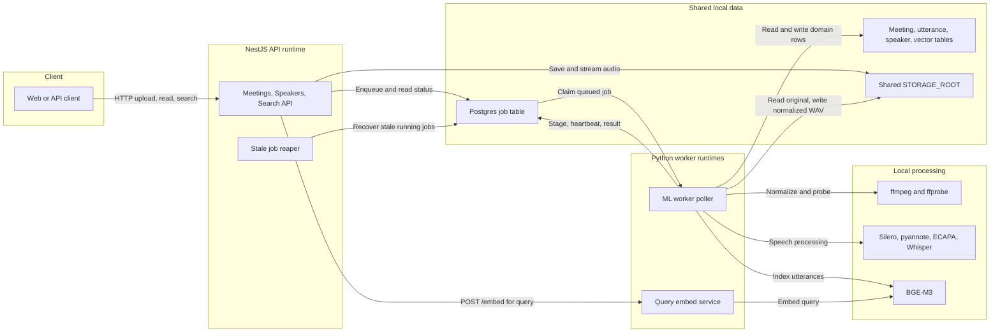
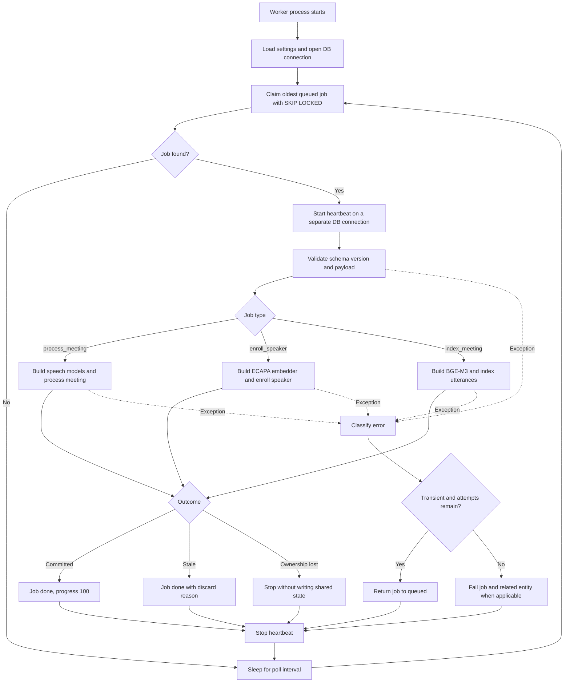
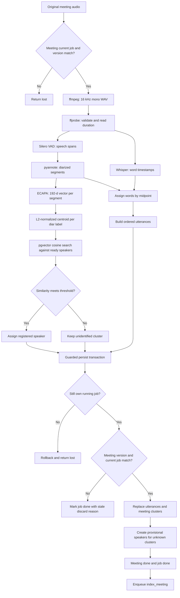
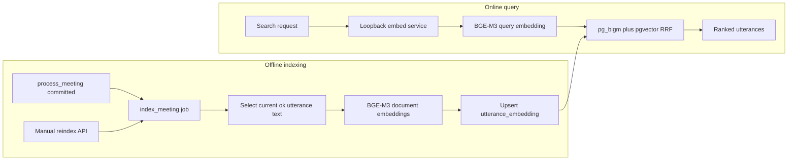
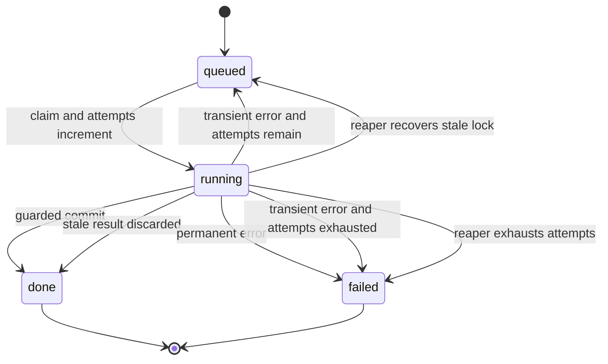

# Damwha Worker 아키텍처와 처리 흐름

> 문서 성격: 현재 구현을 설명하는 살아있는 문서
> 기준일: 2026-07-06
> 범위: `be/worker`, 워커와 직접 연결되는 NestJS job enqueue/reaper, Postgres, 공유 스토리지

## 1. 한눈에 보기

Damwha의 워커 영역에는 서로 다른 두 실행 프로세스가 있다.

1. **ML worker poller** — `python -m damwha_worker`로 실행한다. HTTP 요청을 받지 않고 Postgres `job` 테이블에서 작업을 가져와 회의 처리, 화자 등록, 검색 색인을 수행한다.
2. **Query embed service** — `uvicorn damwha_worker.embed_service:app`으로 실행한다. NestJS 검색 API의 질의 텍스트를 BGE-M3 벡터로 변환하는 loopback 전용 HTTP 서비스다.

NestJS API와 ML worker poller 사이에는 HTTP 호출이 없다. 둘의 비동기 계약은 Postgres `job` 행과 payload이며, 오디오 파일은 같은 `STORAGE_ROOT`를 통해 공유한다.

### 제공 기능

| 기능 | job 또는 서비스 | 핵심 결과 |
|---|---|---|
| 회의 음성 처리 | `process_meeting` | 정규화 음원, 화자별 발언 `utterance`, 미확인 화자 cluster/임시 화자, 후속 색인 job |
| 등록 화자 성문 생성 | `enroll_speaker` | ECAPA 192차원 `voiceprint`, 화자 상태 `ready` |
| 발언 의미검색 색인 | `index_meeting` | BGE-M3 1024차원 `utterance_embedding` |
| 검색 질의 임베딩 | `POST /embed` | 검색어의 BGE-M3 1024차원 벡터 |
| 작업 생명주기 | 공통 worker loop | 원자적 claim, stage/progress, heartbeat, retry/fail, stale 결과 폐기 |

## 2. 시스템 컨텍스트



핵심 경계는 다음과 같다.

- **API의 책임**: 업로드, metadata CRUD, job enqueue, 상태/결과 조회, stale job reaper.
- **worker poller의 책임**: job claim 이후 모델 실행, stage/progress, 결과 저장, 정상/오류 상태 전이.
- **Postgres의 책임**: queue와 결과 저장소를 동시에 담당한다. 별도 Kafka, Redis, RabbitMQ는 없다.
- **공유 파일시스템의 책임**: API가 저장한 원본 오디오를 worker가 읽고 정규화 WAV를 같은 root에 기록한다.
- **embed service의 책임**: 검색 시점의 질의 벡터만 제공한다. job을 claim하거나 회의 상태를 변경하지 않는다.

## 3. Worker 내부 구성

| 영역 | 파일 | 책임 |
|---|---|---|
| 프로세스 진입점/dispatcher | [`worker/damwha_worker/__main__.py`](../worker/damwha_worker/__main__.py) | poll loop, job type 분기, 필요한 모델의 지연 생성, heartbeat 범위, 공통 오류 처리 |
| payload 계약 | [`worker/damwha_worker/contracts.py`](../worker/damwha_worker/contracts.py) | Pydantic 검증, `schema_version=1`, readable ID 형식 검증 |
| DB adapter | [`worker/damwha_worker/db.py`](../worker/damwha_worker/db.py) | raw SQL claim/heartbeat/stage/requeue/fail/persist, ownership/stale guard |
| heartbeat | [`worker/damwha_worker/heartbeat.py`](../worker/damwha_worker/heartbeat.py) | 별도 DB 연결과 daemon thread로 `locked_at` 갱신 |
| storage | [`worker/damwha_worker/storage.py`](../worker/damwha_worker/storage.py) | 상대 key를 root 내부 경로로 안전하게 변환, traversal 차단 |
| 오류 정책 | [`worker/damwha_worker/errors.py`](../worker/damwha_worker/errors.py) | 영구/일시 오류 분류와 `job.error` JSON 생성 |
| 모델 protocol | [`worker/damwha_worker/models/base.py`](../worker/damwha_worker/models/base.py) | VAD, diarizer, speaker embedder, transcriber, text embedder 인터페이스 |
| 모델 조립 | [`worker/damwha_worker/models/registry.py`](../worker/damwha_worker/models/registry.py) | payload와 settings에 따라 실제 adapter 생성 |
| 회의 처리 | [`worker/damwha_worker/pipeline/process_meeting.py`](../worker/damwha_worker/pipeline/process_meeting.py) | normalize부터 결과 persist까지 orchestration |
| 화자 등록 | [`worker/damwha_worker/pipeline/enroll_speaker.py`](../worker/damwha_worker/pipeline/enroll_speaker.py) | 등록 음원 전체의 성문 추출과 persist |
| 검색 색인 | [`worker/damwha_worker/pipeline/index_meeting.py`](../worker/damwha_worker/pipeline/index_meeting.py) | 정상 발언 텍스트 임베딩과 upsert |
| 검색 질의 서비스 | [`worker/damwha_worker/embed_service.py`](../worker/damwha_worker/embed_service.py) | `/health`, `/embed` FastAPI endpoint |

모델은 protocol 뒤에 격리되어 있다. 그래서 pipeline과 DB glue 테스트는 fake 모델로 결정적으로 실행하고, 무겁거나 gated인 실제 모델은 로컬 smoke에서만 검증한다.

## 4. 공통 job 처리 흐름



### Claim과 순서

- `SELECT ... FOR UPDATE SKIP LOCKED LIMIT 1`을 포함한 단일 `UPDATE ... RETURNING`으로 가장 오래된 `queued` job을 claim한다.
- claim 시 `status='running'`, `locked_by`, `locked_at`을 기록하고 `attempts`를 1 증가시킨다.
- type별 priority는 없다. 모든 type이 `created_at` 순서로 같은 queue를 사용한다.
- poller 한 프로세스는 job을 한 번에 하나씩 동기 처리한다.

### Heartbeat와 reaper

- 모델 추론이 메인 thread를 오래 점유하므로 heartbeat는 daemon thread와 별도 psycopg 연결을 사용한다.
- heartbeat는 `job.id + locked_by + running` 조건을 만족할 때만 `locked_at`을 갱신한다.
- NestJS reaper가 5분마다 오래된 `running` job을 찾는다.
- 시도 횟수가 남으면 `queued`로 되돌리고, 소진되면 `failed`로 바꾼다. `process_meeting`은 meeting, `enroll_speaker`는 speaker에도 실패를 전파한다. `index_meeting` 실패는 meeting을 실패시키지 않는다.

## 5. Job 타입별 계약

| job type | 주요 payload | DB stage와 progress | 성공 결과 |
|---|---|---|---|
| `process_meeting` | meeting/audio key, processing version, 모델 snapshot, 식별 threshold | `vad` 15 → `diarize` 35 → `identify` 50 → `stt` 75 → `align` 90 → `persist` 95 → done 100 | meeting과 발언 저장, 미확인 화자 처리, `index_meeting` enqueue |
| `enroll_speaker` | speaker/audio key, embedding model/dimension | `extract_embedding` 30 → `enroll_persist` 80 → done 100 | `voiceprint` 생성, speaker `ready` |
| `index_meeting` | meeting, processing version, search model/dimension | `embed` 20 → done 100 | 발언별 `utterance_embedding` upsert |

공통 payload는 `schema_version`을 갖고 현재 버전 `1`만 지원한다. API의 Zod 계약과 worker의 Pydantic 계약이 같은 fixture를 검증해 drift를 차단한다.

## 6. `process_meeting` 상세 흐름



### 단계별 의미

1. **처리 시작 guard** — meeting의 `current_job_id`와 `processing_version`이 payload와 일치할 때만 `processing`으로 바꾼다.
2. **정규화/검증** — 원본을 16 kHz mono WAV로 만든다. 이미 정규화 파일이 있으면 재사용하며, ffprobe는 항상 duration을 읽는다. 손상 음원과 probe 실패는 영구 오류다.
3. **VAD** — 음성이 존재하는 구간을 구한다. 현재 구현에서 이 결과는 주로 STT 결과가 비었을 때 `transcribe_failed`와 `silence`를 구분하는 데 사용한다.
4. **Diarization** — pyannote가 시간 구간별 `diar_label`을 만든다.
5. **Speaker embedding/identification** — ECAPA가 각 구간을 192차원으로 바꾸고 label별 centroid를 만든다. 같은 model/dimension이면서 `speaker.enrollment_status='ready'`인 voiceprint만 cosine 비교한다.
6. **STT** — payload의 Whisper 모델과 language로 word timestamp를 생성한다. Apple Silicon은 MLX, 그 외 환경은 faster-whisper adapter를 선택할 수 있다.
7. **Align** — word midpoint가 속한 diarization segment에 word를 귀속하고 segment 단위 발언을 만든다. text가 없는 구간도 `silence` 또는 `transcribe_failed` row로 남긴다.
8. **Persist** — ML 계산은 transaction 밖에서 수행하고, 최종 결과 교체만 짧은 transaction에서 원자적으로 처리한다.

### 미확인 화자 자동 생성

식별 threshold를 넘지 못한 label은 persist 시 다음과 같이 처리된다.

- `Speaker_NNN` 형식의 `provisional` speaker를 생성한다.
- centroid를 `source='auto_cluster'`인 voiceprint로 저장한다.
- `meeting_cluster.resolved_speaker_id`와 해당 utterance를 임시 speaker에 연결한다.
- 사용자가 이름을 확정하면 API가 `provisional`을 `ready`로 승격한다.
- 재처리로 참조가 사라진 미확정 provisional speaker는 GC한다. `ready` speaker는 삭제하지 않는다.

## 7. `enroll_speaker` 처리 흐름


- 등록에는 VAD, diarization, Whisper가 필요하지 않으며 현재 dispatcher는 전용 `build_embedder`로 ECAPA만 생성한다.
- 샘플 전체를 하나의 segment로 임베딩하므로 10~30초 정도의 깨끗한 단일 화자 음원이 적합하다.
- transaction 안에서 job ownership과 `speaker.current_job_id`를 확인한 뒤 voiceprint insert, speaker `ready`, job `done`을 함께 반영한다.
- 실패 시 job과 speaker가 함께 `failed`가 된다. 더 새로운 등록 job이 speaker를 선점했다면 현재 결과는 `lost`로 폐기한다.

## 8. `index_meeting`과 검색 질의 흐름



### Offline indexing

- 정상 처리된 `process_meeting` transaction이 `index_meeting`을 자동 enqueue한다.
- `POST /meetings/:id/reindex`, `POST /meetings/reindex-missing`으로 수동 enqueue도 가능하다.
- 현재 processing version의 `status='ok'`이고 text가 있는 utterance만 BGE-M3로 변환한다.
- `(utterance_id, model)` unique key로 upsert한다.
- persist 전에 job ownership과 meeting processing version을 확인한다. 새 재처리가 추월했으면 embedding을 쓰지 않고 stale discard한다.
- 색인 실패는 회의 처리 결과를 무효화하지 않는다. meeting은 `done`을 유지하고 keyword 검색은 계속 가능하다.

### Online query embedding

- NestJS Search API는 worker poller가 아니라 별도 `embed_service`의 `POST /embed`를 호출한다.
- 기본 주소는 `127.0.0.1:8100`이며, 비-loopback 주소는 명시적으로 허용하지 않으면 거부된다.
- service 응답의 model, dimension, vector 개수/길이, 유한성을 API가 검증한다.
- timeout, 연결 실패, 계약 불일치 시 keyword-only 검색으로 degrade한다.

주의할 점은 worker의 index job과 embed service가 같은 BGE-M3 adapter를 사용하지만 **서로 다른 프로세스와 모델 인스턴스**라는 것이다.

## 9. Job 상태와 실패 처리



`lost`는 DB status가 아니라 worker 함수의 outcome이다. 이미 job ownership을 잃었으므로 현재 worker는 상태 전이를 하지 않고 중단하며, 새 소유자나 reaper가 DB 상태를 책임진다.

### 오류 분류

| 분류 | 대표 사례 | 처리 |
|---|---|---|
| Permanent | 손상 음원, 지원하지 않는 형식, ffprobe 실패, 지원하지 않는 payload version, 모델 package import 실패 | 즉시 fail |
| Transient | OOM, 분류되지 않은 runtime 오류, 기타 일시 장애 | attempts가 남으면 즉시 requeue, 아니면 fail |

현재 queue schema에는 `next_attempt_at`이 없어 exponential backoff가 없다. requeue 뒤 공통 poll interval만 적용된다.

## 10. 일관성 모델과 안전장치

이 queue는 crash/reaper/retry 때문에 동일 job이 다시 실행될 수 있는 at-least-once 구조다. 정확성을 위해 결과 저장 시 두 종류의 guard를 사용한다.

### Job ownership guard

```sql
WHERE job.id = :job_id
  AND job.locked_by = :worker_id
  AND job.status = 'running'
```

같은 job이 requeue된 뒤 다른 worker가 다시 claim한 경우, 이전 worker가 늦게 결과를 덮어쓰지 못하게 한다.

### Entity stale guard

- 회의 처리: `meeting.processing_version`과 `meeting.current_job_id`가 payload/job과 일치해야 한다.
- 검색 색인: `meeting.processing_version`이 payload와 일치해야 한다.
- 화자 등록: `speaker.current_job_id`가 현재 job과 일치해야 한다.

guard 결과에 따른 의미는 다음과 같다.

| 판정 | outcome | 공유 상태 처리 |
|---|---|---|
| job ownership 없음 | `lost` | transaction rollback, 현재 worker는 아무 상태도 쓰지 않음 |
| job은 소유하지만 meeting version이 stale | `discarded` | meeting/result 무변경, job은 `done`과 discard reason 기록 |
| 모든 guard 통과 | `committed` | entity 결과와 job 완료를 같은 transaction에서 반영 |

## 11. 저장 데이터와 파일

| 저장소 | worker가 읽는 값 | worker가 쓰는 값 |
|---|---|---|
| `job` | type, payload, attempts/max attempts | status, stage, progress, lock, error |
| `meeting` | audio key, current job, processing version | processing/done/failed, normalized key, duration, error |
| `speaker` | ready voiceprint의 소유자, current enroll job | ready/failed/provisional 상태 |
| `voiceprint` | 등록 화자 식별 후보 | enroll 성문, auto-cluster centroid |
| `utterance` | index 대상 text | 시간, 화자, text, confidence, status, version/job stamp |
| `meeting_cluster` | 미식별/수동 resolve 정보 | diar label, centroid, provisional speaker 연결 |
| `utterance_embedding` | 검색용 dense vector | BGE-M3 1024차원 vector와 version/job stamp |
| `STORAGE_ROOT` | 원본 회의/화자 음원 | `meetings/<id>/normalized.wav`, `speakers/<id>/normalized.wav` |

DB에는 상대 storage key만 저장한다. `Storage.resolve()`는 root 밖으로 나가는 absolute path와 `..` traversal을 거부한다.

## 12. 모델과 실행 환경

| 역할 | 구현 | 실행 특성 |
|---|---|---|
| 미디어 정규화/검증 | ffmpeg, ffprobe | 시스템 binary 필요, 16 kHz mono WAV 생성 |
| 음성 구간 탐지 | Silero VAD | PyTorch 계열 |
| 화자 분리 | pyannote.audio | Hugging Face gated 모델과 token/license 필요 |
| 화자 임베딩 | SpeechBrain ECAPA | 192차원, MPS 설정에서도 안정성을 위해 CPU 사용 |
| 음성 인식 | mlx-whisper 또는 faster-whisper | Apple Silicon은 MLX, CUDA/CPU는 faster-whisper 가능 |
| 텍스트 임베딩 | BAAI/bge-m3 | 1024차원, index worker와 embed service에서 사용 |

필수 환경은 Python 3.12, `uv`, Postgres 16과 pgvector/pg_bigm, 공유 storage, ffmpeg/ffprobe다. 실제 모델 실행에는 `uv sync --extra models`가 필요하다.

## 13. 실행 순서

```bash
# 1. Postgres
docker compose up -d
npm run migrate

# 2. 검색 질의 embed service
cd worker
uv run uvicorn damwha_worker.embed_service:app --host 127.0.0.1 --port 8100

# 3. NestJS API
cd ..
npm run start:dev

# 4. ML worker poller
cd worker
uv run python -m damwha_worker
```

`docker compose`는 Postgres만 실행한다. API, worker poller, embed service는 현재 host 프로세스로 별도 실행한다.

## 14. 현재 구현 특성 및 운영 시 주의점

- worker poller는 동기 직렬 처리다. 한 프로세스에서 동시에 여러 job을 실행하지 않는다.
- 각 job을 claim한 뒤 필요한 모델 adapter를 생성한다. 장시간 실행 시 모델 warm-up 비용과 memory 사용을 관찰해야 한다.
- `process_meeting`의 정규화 파일은 존재하면 재사용한다. 원본 변경 여부를 hash로 검증하지는 않는다.
- `STT_CHUNK_MINUTES` 설정은 존재하지만 현재 adapter가 수동 chunk 분할에 사용하지 않는다. MLX/faster-whisper 내부 처리를 따른다.
- poller 자체 HTTP health endpoint는 없다. `embed_service`만 `/health`를 제공한다. poller 상태는 heartbeat와 job 진행률로 판단한다.
- stage 성능 로그에는 job/entity ID와 count만 기록하고 transcript, 화자 PII, absolute path는 기록하지 않는다.
- 검색 embedding 실패는 keyword-only로 degrade하지만, 회의 음성 처리의 모델 실패는 job retry/fail 정책을 따른다.

## 15. 테스트와 검증 경계

- `worker/tests`: fake 모델과 실제 Postgres testcontainer로 계약, pipeline glue, ownership guard, retry/fail, provisional speaker, 검색 색인을 검증한다.
- `worker/scripts/smoke_process_meeting.py`: 실제 모델로 회의 전체 pipeline을 수동 검증한다.
- `worker/scripts/smoke_enroll_identify.py`: 실제 화자 등록과 식별을 수동 검증한다.
- `worker/SMOKE.md`: gated 모델 준비와 full-stack 실행 절차를 설명한다.

```bash
cd worker
uv run pytest -q
uv run ruff check .
```

## 16. 관련 문서

- [`worker/SMOKE.md`](../worker/SMOKE.md) — 실제 모델과 full-stack smoke 절차
- [`docs/superpowers/specs/2026-06-23-damwha-ml-worker-design.md`](./superpowers/specs/2026-06-23-damwha-ml-worker-design.md) — 초기 worker 설계 스냅샷
- [`docs/superpowers/specs/2026-06-26-damwha-search-design.md`](./superpowers/specs/2026-06-26-damwha-search-design.md) — 검색/index/embed service 설계 스냅샷
- [`AGENTS.md`](../AGENTS.md) — 현재 backend 불변식과 개발 규칙
