# Damwha UX / 와이어프레임 리뷰 (2026-09-28)

- 대상: `http://localhost:5173` (Electron 앱의 개발용 브라우저 빌드)
- 사전 정보: 서비스 사이트(https://damwha.0kimjae.dev/)만 확인
- 사이트가 약속하는 핵심 가치
  1. 목소리로 화자를 구분하고, 한 번 등록하면 다른 회의에서도 알아봄
  2. ⌘K 검색 → Enter로 "정확한 초"로 점프 (Utterance jump)
  3. Lenses: 결정·할 일·약속 추출, 근거 링크 포함
  4. 전부 로컬(온디바이스) 처리
- 사용해 본 흐름: ⌘K 검색 → 점프, 재생, 발언 저장/원문 보기, 새 회의 기록(파일/실시간), 저장한 발언, 할 일·결정·약속, 화자 관리/화자 확인, 처리 설정, 회의 내 찾기
- 직접 확인하지 못한 것: 실제 녹음/업로드 처리, 창 리사이즈, 네이티브 앱 메뉴. 데이터가 바뀌거나 오래 걸리는 작업(삭제, 재처리)은 누르지 않음.

---

## 총평

뼈대는 좋다. 3단 레이아웃(목록 / 전사 / 인사이트)과 하단 화자별 타임라인, ⌘K 팔레트, 회의 내 찾기(n/m 이동, 하이라이트)는 완성도가 있다.
문제는 **사이트에서 가장 강하게 파는 두 가지 약속, "정확한 초로 점프"와 "렌즈"를 UI가 받쳐주지 못한다**는 점이다.

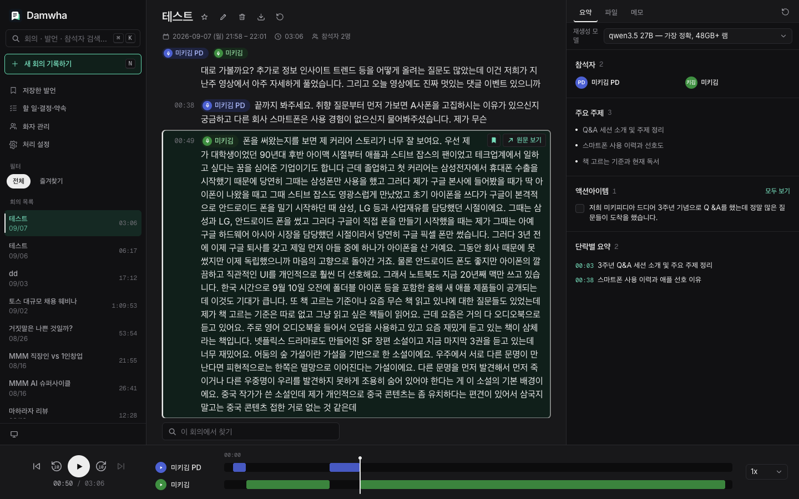

---

## P0: 핵심 가치가 깨지는 부분

### 1. 발언 단위가 너무 커서 "초 단위 점프"가 성립하지 않음

- "테스트"(09/07) 회의의 00:49 발언은 약 2분짜리 한 덩어리다.
- ⌘K에서 "아이폰"을 검색하고 Enter를 누르면 그 2분 블록의 시작점으로 간다. 블록 안에서 "아이폰" 단어는 하이라이트되지 않는다.
- 재생 중에도 블록 전체가 하이라이트될 뿐, 지금 어디를 읽는지 알 수 없다.

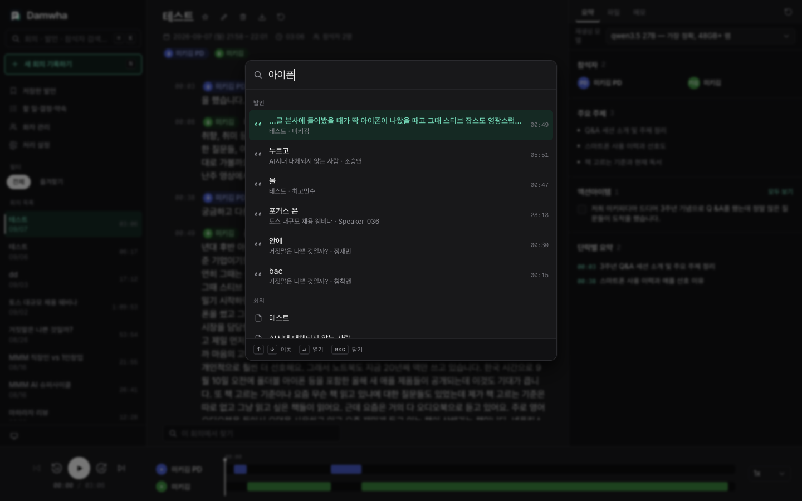

**제안**
- 단어나 문장 단위로 하이라이트(karaoke 방식)
- 검색 점프는 매칭된 단어의 타임스탬프로 보내기
- 긴 발언은 문장 단위로 쪼개서 보여주기

### 2. 렌즈 결과가 요약이 아니라 발언 원문 복사 수준

- 액션아이템에 "저희 미키피디아 드디어 3주년 기념으로 Q&A를 했는데…"가 들어가 있다. 10줄이 넘는 발언 원문이 체크박스 항목으로 그대로 올라간 경우도 여러 개다. 담당자나 기한도 없다.
- 결정사항에도 체크박스가 있다. 결정은 "완료"하는 대상이 아니다.
- 중복: "지원 기간: 9월 1일부터 14일까지"와 "2026년 9월 1일부터 14일까지 총 2주 동안 진행"이 따로 잡힌다.
- 오분류: "첫 번째 질문: 다음 프로젝트 중 하나만 고른다면?" 같은 질문이 결정사항으로 들어간다.
- 설정상 요약은 27B 모델인데 렌즈 추출은 4B 모델로 돈다. 이 차이가 사용자에게 전혀 안 보인다.

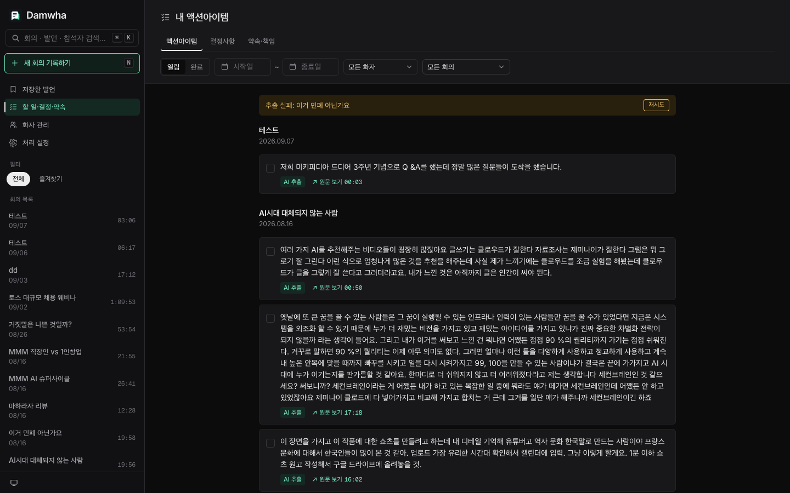

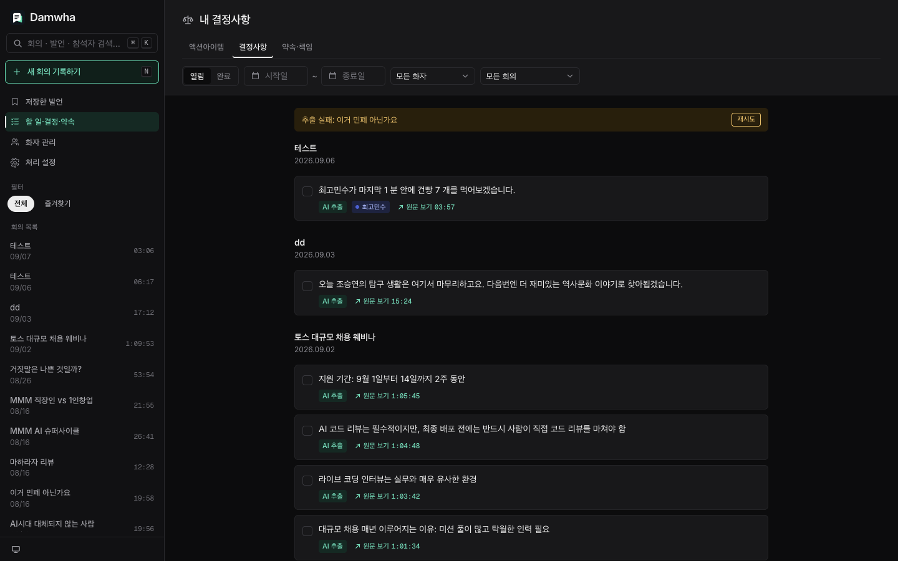

**제안**
- 추출 결과를 바로 목록에 넣지 말고 "제안" 상태로 두고 사용자가 승인하게 하기
- 항목을 "누가 / 무엇을 / 언제" 형태로 정규화하기
- 결정사항에서 체크박스 제거
- 중복 병합

### 3. 전사를 고칠 수 없음

- 전사 안의 화자 칩은 클릭되지 않는다. 발언 텍스트 편집도, 발언 하나만 화자를 다시 지정하는 것도 안 된다.
- 실제로 00:38 "끝까지 봐주세요"가 문장 중간에서 잘려 다른 화자에게 붙어 있는데 고칠 방법이 없다.
- 화자 매핑은 회의 전체 단위의 "화자 확인"으로만 가능하다.

### 4. 재생 조작이 직관적이지 않음

- 발언 텍스트나 타임스탬프를 눌러도 재생 위치가 바뀌지 않는다. 호버해야 나오는 작은 "원문 보기" 버튼으로만 이동된다.
- "원문 보기" 라벨이 회의 화면에서는 "이 시점으로 이동", 렌즈 화면에서는 "회의로 이동"이다. 같은 라벨에 다른 동작.
- 테스트에서는 Space 키로 재생/정지가 되지 않았다.

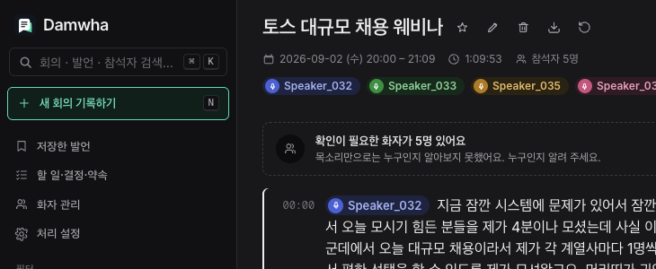

---

## P1: 사용성 문제

### 5. ⌘K 검색 결과에 노이즈가 많음

- "아이폰" 검색 결과에 "누르고", "물", "포커스 온", "bac" 같은 무관한 조각이 섞인다. 왜 매칭됐는지도 안 보인다.
- 처리 설정을 보면 검색 임베딩 모델이 "일부만 받음(4.6GB)" 상태다. 검색이 반쯤 망가진 상태일 수 있는데 검색 UI에는 아무 경고가 없다.
- 회의 결과에 "테스트"가 두 번 나오는데 날짜가 없어 구분할 수 없다.

### 6. 새 기록 모달이 무거움

- 녹음 시작 전에 폼이 길다: 제목, 최소/최대 화자 수, 후속 처리 2개, 작업별 설정. 실시간 녹음은 "지금 바로 시작"이 핵심인데 여기서 마찰이 생긴다.
- "이번 작업만 다른 설정 사용 안 함" 버튼은 현재 상태를 말하는 건지 누르면 일어날 동작인지 헷갈린다.
- "한마디만 한 사람은 빼고 세요" 문구는 한 번에 이해하기 어렵다.
- "녹음 시작" 버튼이 마이크 확인 스피너 상태로 계속 비활성이었다. 브라우저 환경 탓일 가능성이 크지만, Electron에서도 권한을 거부했을 때 이렇게 멈추지 않는지 확인이 필요하다. 타임아웃, "시스템 설정 열기" 버튼, 재시도가 있으면 좋겠다.

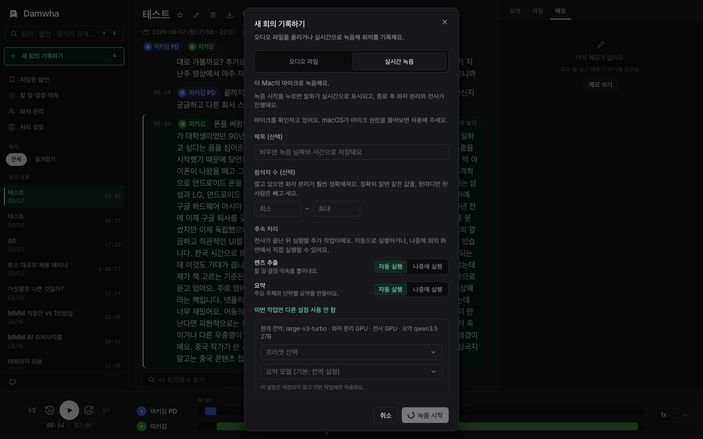

### 7. 화자 관리와 화자 확인

**화자 관리**
- 미확정 "Speaker_0xx" 7개가 등록된 화자와 한 목록에 섞여 있다.
- "미확정"인데 "2026.09.03 등록"이라고 표시돼서 모순처럼 읽힌다.
- 각 화자가 어느 회의에서 나왔는지, 몇 번 등장했는지 안 보인다.
- 병합 기능이 없다("미키김"과 "미키김 PD" 같은 경우).

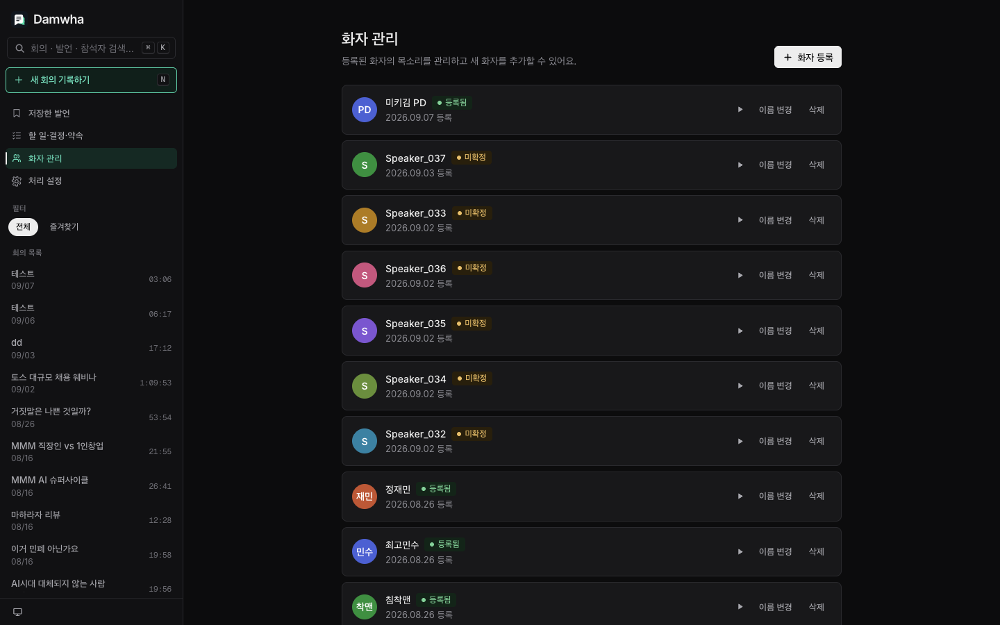

**화자 확인 다이얼로그**
- 오디오 샘플만 있고 텍스트 발췌가 없다.
- 샘플 5개가 모두 "00:08"로 표시된다. 시점인지 길이인지 모호하다.
- 저장이 행마다 따로라서 한 번에 저장할 수 없다.
- 드롭다운에 검색이 없다. 같은 회의의 다른 Speaker가 옵션에 섞여 있어서, 고르면 병합이 되는 건지 불분명하다.

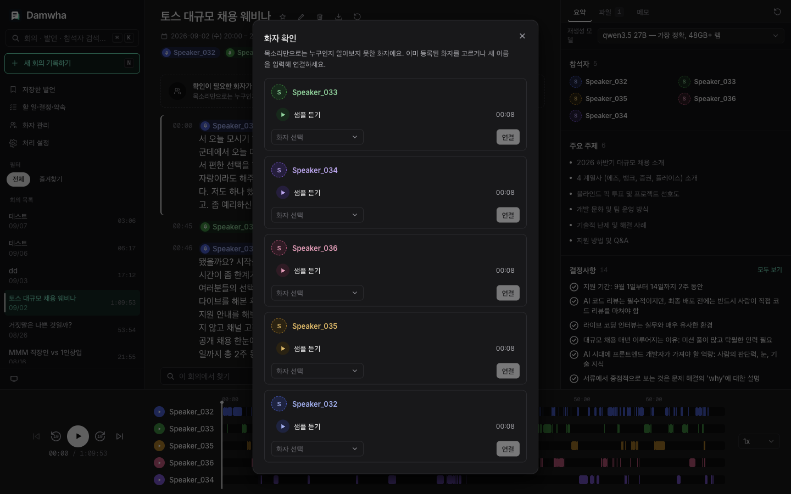

### 8. 우측 인사이트 패널

- 맨 위 가장 좋은 자리를 "재생성 모델" 드롭다운이 차지한다. 라벨도 "재생성 모 / 델"로 줄바꿈된다. 가끔만 쓰는 설정이라 아래로 내리는 게 맞다.
- 섹션 구성이 회의마다 다르다. 어떤 회의는 액션아이템이, 어떤 회의는 결정사항이 나온다.
- "파일" 탭에는 원본 오디오 1개만 나온다. 그런데 빈 상태 문구가 "공유된 파일이 없어요"라서 공유나 첨부 기능이 있는 것처럼 오해하게 된다. 탭을 없애고 헤더 메타 정보로 옮기는 걸 추천한다.

### 9. 헤더 아이콘

- 라벨 없는 아이콘 5개가 나란히 있고, 삭제(휴지통)가 편집 바로 옆이다.
- "회의 재처리"와 우측 "요약 다시 만들기"가 둘 다 원형 화살표 아이콘이다. 비용이 완전히 다른 작업인데 구분이 안 된다.
- 삭제는 눌러보지 않았으니 확인창 유무를 직접 확인할 것.

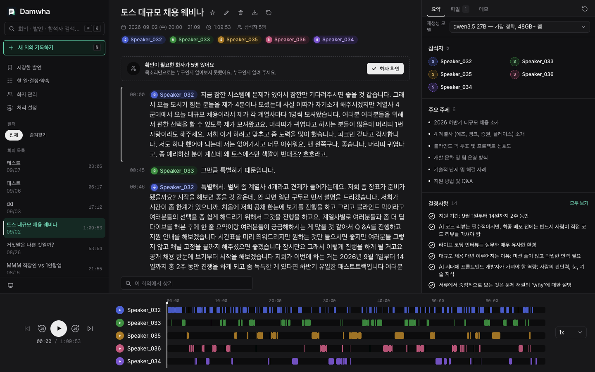

---

## P2: 정보 구조와 일관성

### 용어가 제각각

같은 개념을 부르는 이름이 화면마다 다르다.

| 위치 | 표기 |
| --- | --- |
| 사이드바 | 할 일·결정·약속 |
| 페이지 제목 | 내 액션아이템 |
| 새 기록 모달 | 렌즈 추출 |
| 서비스 사이트 | Lenses |

페이지 제목의 "내"도 문제다. 앱에 "나"라는 개념이 없는데 모든 화자의 항목을 보여준다.

### 언어 혼재

- Display language가 English인데 UI 대부분은 한국어다.
- 처리 설정 한 페이지 안에서도 영어와 한국어가 섞여 있다.
- 앱 전체 설정(General)이 "처리 설정" 안에 들어가 있는 것도 어색하다.

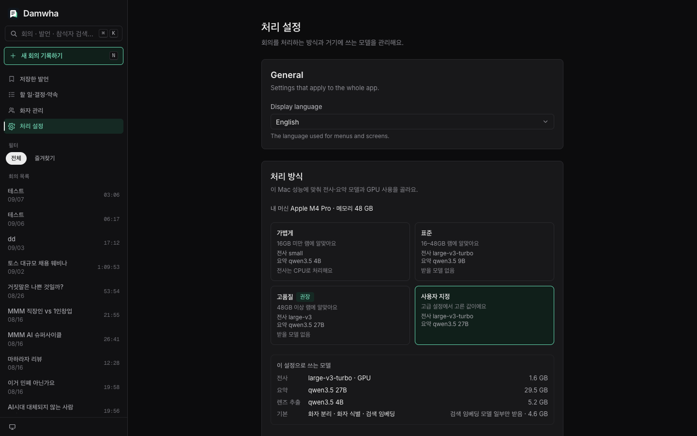

### 회의 목록

- 제목이 "테스트, 테스트, dd, 다시"다. 제목이 선택 입력이라 이렇게 쌓인다. 요약에서 뽑은 주제로 자동 제목을 만들어 주는 게 좋다.
- 목록 안 검색, 정렬, 날짜별 그룹이 없다.
- "이거 민폐 아닌가요"는 렌즈 추출이 실패했는데, 이 사실이 렌즈 페이지 배너에만 나오고 목록에는 표시가 없다.

### 하단 타임라인

- 화자 수만큼 높아진다. 5명일 때 이미 약 190px이라 전사 영역을 잠식한다. 접기나 한 줄 모드가 필요하다.
- 회의 내 찾기 결과를 타임라인에 마커로 찍어주면 좋겠다.

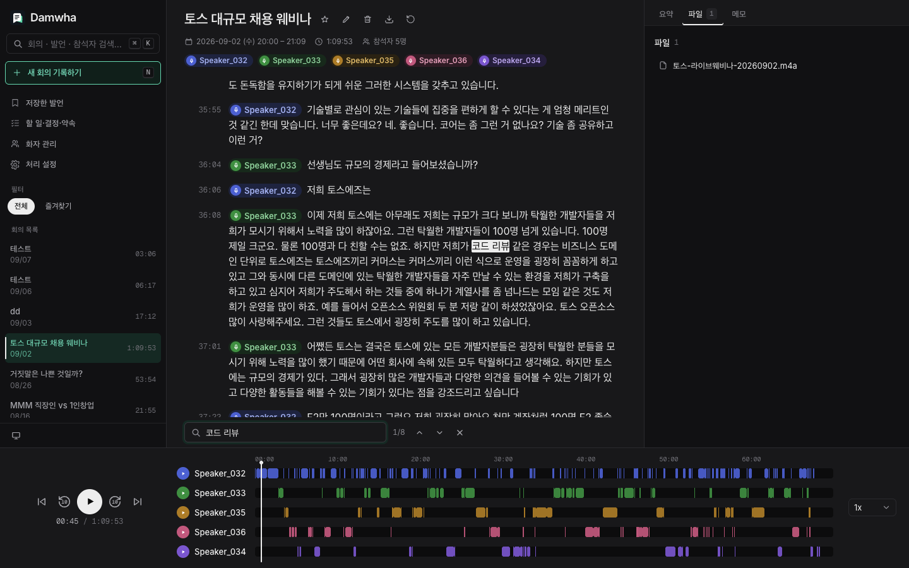

### 자잘한 것들

- 좌하단 모니터 아이콘(테마 전환)이 무엇인지 알 수 없다.
- 아바타 이니셜이 "미키김 → 키김", "침착맨 → 착맨"처럼 뒤 두 글자로 잘린다.

### Hugging Face 토큰

- 사이트에는 "앱 안에서 추가"한다고 되어 있는데, 처리 설정 화면에서는 입력하는 곳을 찾지 못했다. 앱 메뉴나 온보딩에 있을 수도 있다.
- 화자 분리가 핵심 기능이므로 토큰이 없을 때 어떤 상태인지 앱 안에서 보여야 한다.

---

## Electron 데스크톱 앱 관점

- **웹 앱 패턴이 강하다**
  - 설정이 사이드바의 주요 메뉴에 있다. macOS 관례대로 `⌘,` 로 여는 설정 창으로 빼는 게 자연스럽다.
  - 새 기록이 모달이라 녹음하는 동안 다른 회의를 보기 어렵다. 떠 있는 미니 레코더나 메뉴바 아이콘을 추천한다.
- **타이틀바**: 로고가 좌상단 끝에 붙어 있다. `hiddenInset` 타이틀바를 쓰면 신호등 버튼과 겹칠 수 있으니 여백과 드래그 영역을 확인할 것.
- **단축키**: Space 재생, `⌘F` 회의 내 찾기, ←/→ 10초 이동 정도는 데스크톱 앱이면 당연히 기대하는 동작이다. 앱 메뉴 단축키로 이미 있다면 무시해도 된다.
- **파일과 처리 상태**: 창에 오디오 파일을 드래그해서 올리기, "Finder에서 보기", 긴 처리가 끝났을 때 Dock 배지나 알림이 있으면 좋겠다.

---

## 먼저 고치면 좋을 5개

1. 단어/문장 단위 하이라이트, 그리고 클릭하면 그 시점으로 이동
2. 렌즈 항목 정규화(누가/무엇을/언제)와 결정사항 체크박스 제거
3. 발언 텍스트 편집과 발언 단위 화자 재지정
4. 검색 모델 상태 경고, 매칭 근거 표시
5. 실시간 녹음을 원클릭으로 바로 시작(설정은 녹음 후에)
